# Airbnb-Data-Science
This repository consists of following two projects

# Predictive Price Modeling for Airbnb listings
The project aimed at predicting the price of an Airbnb listing given a number of features. The project involved exploratory data analysis, data pre-processing, feature selection, Model Fitting, Model Comparison and deploying the containerised Webapp on AWS using CI/CD Pipeline.

## Project Resources
<div class="row">
	<div class="col-lg-8 col-md-10 col-sm-10 col-12 mx-auto">
	  <ul>
	    <li><a href="http://ec2-65-0-106-104.ap-south-1.compute.amazonaws.com:5000/">AWS Webapp</a> for this project</li>
	    <li>View Project <a href="http://deepakkarkala.com/docs/articles/machine_learning/airbnb_price_modeling/about/index.html">Report</a></li>
	    <li><a href="https://public.opendatasoft.com/explore/dataset/airbnb-listings/information/?disjunctive.host_verifications&disjunctive.amenities&disjunctive.features&dataChart=eyJxdWVyaWVzIjpbeyJjaGFydHMiOlt7InR5cGUiOiJjb2x1bW4iLCJmdW5jIjoiQ09VTlQiLCJ5QXhpcyI6Imhvc3RfbGlzdGluZ3NfY291bnQiLCJzY2llbnRpZmljRGlzcGxheSI6dHJ1ZSwiY29sb3IiOiJyYW5nZS1jdXN0b20ifV0sInhBeGlzIjoiY2l0eSIsIm1heHBvaW50cyI6IiIsInRpbWVzY2FsZSI6IiIsInNvcnQiOiIiLCJzZXJpZXNCcmVha2Rvd24iOiJyb29tX3R5cGUiLCJjb25maWciOnsiZGF0YXNldCI6ImFpcmJuYi1saXN0aW5ncyIsIm9wdGlvbnMiOnsiZGlzanVuY3RpdmUuaG9zdF92ZXJpZmljYXRpb25zIjp0cnVlLCJkaXNqdW5jdGl2ZS5hbWVuaXRpZXMiOnRydWUsImRpc2p1bmN0aXZlLmZlYXR1cmVzIjp0cnVlfX19XSwidGltZXNjYWxlIjoiIiwiZGlzcGxheUxlZ2VuZCI6dHJ1ZSwiYWxpZ25Nb250aCI6dHJ1ZX0%3D">Airbnb Dataset</a> used in the project</li>
	    <li>Run this code on <a href="https://colab.research.google.com/drive/1IBYyAjdGXzAeNPSdNbfIyzgu-lG6Hvlp?usp=sharing">Google Colab</a></li>
	    <li>View Source on <a href="https://github.com/deepak-karkala/airbnb-data-science/tree/master/webapp_predict_price">Github</a></li>
	    <li>Docker Container for the project: dkarkala01/airbnb-predict</li>
	  </ul>
	</div>
</div>

# Alternate Search Rankings for Airbnb
The project involved coming up with alternate search rankings based on Listing Vibe, Aesthetic Quality of listings photos and using A/B testing for comparing different search rankings.

## Project Resources
<div class="row">
    <div class="col-lg-8 col-md-10 col-sm-10 col-12 mx-auto">
      <ul>
        <li><a href="http://ec2-65-0-106-104.ap-south-1.compute.amazonaws.com:5002/">AWS Webapp</a> for this project</li>
        <li>View Project <a href="http://deepakkarkala.com/docs/articles/machine_learning/airbnb_alternate_search/about/index.html">Report</a></li>
        <li><a href="https://public.opendatasoft.com/explore/dataset/airbnb-listings/information/?disjunctive.host_verifications&disjunctive.amenities&disjunctive.features&dataChart=eyJxdWVyaWVzIjpbeyJjaGFydHMiOlt7InR5cGUiOiJjb2x1bW4iLCJmdW5jIjoiQ09VTlQiLCJ5QXhpcyI6Imhvc3RfbGlzdGluZ3NfY291bnQiLCJzY2llbnRpZmljRGlzcGxheSI6dHJ1ZSwiY29sb3IiOiJyYW5nZS1jdXN0b20ifV0sInhBeGlzIjoiY2l0eSIsIm1heHBvaW50cyI6IiIsInRpbWVzY2FsZSI6IiIsInNvcnQiOiIiLCJzZXJpZXNCcmVha2Rvd24iOiJyb29tX3R5cGUiLCJjb25maWciOnsiZGF0YXNldCI6ImFpcmJuYi1saXN0aW5ncyIsIm9wdGlvbnMiOnsiZGlzanVuY3RpdmUuaG9zdF92ZXJpZmljYXRpb25zIjp0cnVlLCJkaXNqdW5jdGl2ZS5hbWVuaXRpZXMiOnRydWUsImRpc2p1bmN0aXZlLmZlYXR1cmVzIjp0cnVlfX19XSwidGltZXNjYWxlIjoiIiwiZGlzcGxheUxlZ2VuZCI6dHJ1ZSwiYWxpZ25Nb250aCI6dHJ1ZX0%3D">Airbnb Dataset</a> used in the project</li>
        <li>Run this code on <a href="https://colab.research.google.com/drive/1zYMSx7GFDmP7f36ElkUPt5ZDzke_NtuK?usp=sharing">Google Colab</a></li>
        <li>View Source on <a href="https://github.com/deepak-karkala/airbnb-data-science/tree/master/webapp_alternate_search_top/webapp_alternate_search">Github</a></li>
        <li>Docker Container for the project: dkarkala01/airbnb-search</li>
      </ul>
    </div>
  </div>


# Project Report: Predictive Price Modeling for Airbnb listings
The project aimed at predicting the price of an Airbnb listing given a number of features. The project involved exploratory data analysis, data pre-processing, feature selection, Model Fitting, Model Comparison and deploying the containerised Webapp on AWS using CI/CD Pipeline.

## Project Goals and Objectives
<div class="row">
    <div class="col-lg-8 col-md-10 col-sm-10 col-12 mx-auto">
      <p style="margin-top:0px;">The Short Answer: Assisting Airbnb hosts to set appropriate price for their listings</p>
      <p class="p_no_top_gap">
        <b>The Problem</b>: Currently there is no convenient way for a new Airbnb host to decide the price of his or her listing. New hosts must often rely on the price of neighbouring listings when deciding on the price of their own listing.
      </p>
      <p class="p_no_top_gap">
        <b>The Solution</b>: A Predictive Price Modelling tool whereby a new host can enter all the relevant details such as location of the listing, listing properties, available amenities etc and the Machine Learning Model will suggest the Price for the listing. The Model would have previously been trained on similar data from already existing Airbnb listings.
      </p>
    </div>
 </div>

  <div class="row">
    <div class="col-lg-8 col-md-10 col-sm-10 col-12 mx-auto">
      <h3 class="sub-title">Project Overview</h3>
    </div>
  </div>

  <div class="row">
    <div class="col-lg-8 col-md-10 col-sm-10 col-12 mx-auto">
      <p class="p_no_top_gap">
        The project involved the following steps,
        <ul>
          <li><b>Exploratory Data Analysis</b>: Explore the various features, their distributions using Histograms and Box-plots</li>
          <li><b>Pre-processing and Data Cleaning</b>: Normalisation, filling missing values, encoding categorical values</li>
          <li><b>Feature Selection</b>: Study the correlation with response variable (Listing Price) and determine which features are most useful in predicting the price.</li>
          <li><b>Model Fitting and Selection</b>: Training different models, tuning hyper-parameters and studying Model performance using Learning Curve.</li>
          <li><b>Model Serving</b>: Using FLASK to deploy and serve Model predictions using REST API</li>
          <li><b>Container</b>: Using Docker to containerise the Web Application</li>
          <li><b>Production</b>: Using AWS CI/CD Pipeline for continuous integration and deployment.</li>
        </ul>
      </p>
    </div>
  </div>


  <div class="row">
    <div class="col-lg-6 col-md-10 col-sm-10 col-10 mx-auto image_top">
      
    </div>
  </div>

  <div class="row">
    <div class="col-lg-8 col-md-10 col-sm-10 col-12 mx-auto">
      <h3 class="sub-title">End Result</h3>
    </div>
  </div>

  <div class="row">
    <div class="col-lg-8 col-md-10 col-sm-10 col-12 mx-auto">
      <p class="p_no_top_gap">
        The screen capture of the entire application in use is shown below. Users can enter all the relevant details of their listings, the trained Predictive Model will then predict and return the price of the listing given all the features. The Webapp can be explored <a href="http://ec2-65-0-106-104.ap-south-1.compute.amazonaws.com:5000/">here</a>.
      </p>
    </div>
  </div>

  <div class="row">
    <div class="col-lg-6 col-md-10 col-sm-10 col-10 mx-auto image_top">
      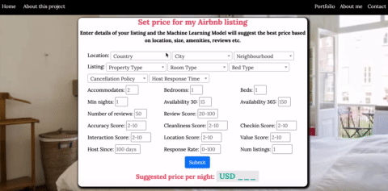
    </div>
  </div>

  <div class="row">
        <div class="col-lg-8 col-md-10 col-sm-10 col-12 mx-auto">
          <h2>About Dataset</h2>
        </div>
      </div>

  <div class="row">
    <div class="col-lg-8 col-md-10 col-sm-10 col-12 mx-auto">
      <p class="p_no_top_gap">
        The Dataset used in this project was obtained from <a href="https://public.opendatasoft.com/explore/dataset/airbnb-listings/table/?disjunctive.host_verifications&disjunctive.amenities&disjunctive.features&dataChart=eyJxdWVyaWVzIjpbeyJjaGFydHMiOlt7InR5cGUiOiJjb2x1bW4iLCJmdW5jIjoiQ09VTlQiLCJ5QXhpcyI6Imhvc3RfbGlzdGluZ3NfY291bnQiLCJzY2llbnRpZmljRGlzcGxheSI6dHJ1ZSwiY29sb3IiOiJyYW5nZS1jdXN0b20ifV0sInhBeGlzIjoiY2l0eSIsIm1heHBvaW50cyI6IiIsInRpbWVzY2FsZSI6IiIsInNvcnQiOiIiLCJzZXJpZXNCcmVha2Rvd24iOiJyb29tX3R5cGUiLCJjb25maWciOnsiZGF0YXNldCI6ImFpcmJuYi1saXN0aW5ncyIsIm9wdGlvbnMiOnsiZGlzanVuY3RpdmUuaG9zdF92ZXJpZmljYXRpb25zIjp0cnVlLCJkaXNqdW5jdGl2ZS5hbWVuaXRpZXMiOnRydWUsImRpc2p1bmN0aXZlLmZlYXR1cmVzIjp0cnVlfX19XSwidGltZXNjYWxlIjoiIiwiZGlzcGxheUxlZ2VuZCI6dHJ1ZSwiYWxpZ25Nb250aCI6dHJ1ZX0%3D">public.opendatasoft.com</a>. There are a total of 494,954 records each of which contains details of one Airbnb listing. The total size of dataset is 1.89 GB. 
      </p>
      <p class="p_no_top_gap">
        The dataset has a large number of features which can be categorised into following types,
        <ul>
          <li>
            <b>Location related</b>: Country, City, Neighbourhood
          </li>
          <li>
            <b>Property related</b>: Property Type, Room Type, Accommodates, Bedrooms, Beds, Bed Type, Cancellation Policy, Minimum Nights
          </li>
          <li>
            <b>Booking Availability</b>: Availability 30, Availability 60, Availability 90, Availability 365
          </li>
          <li>
            <b>Reviews related</b>: Number of Reviews, Reviews per Month, Review Scores Rating, Review Scores Accuracy, Review Scores Cleanliness, Review Scores Checkin, Review Scores Communication, Review Scores Location, Review Scores Value
          </li>
          <li>
            <b>Host related</b>: Host Since, Host Response Time, Host Response Rate, Calculated host listings count, Host Since Days, Host Has Profile Pic, Host Identity Verified, Is Location Exact, Instant Bookable, Host Is Superhost, Require Guest Phone Verification, Require Guest Profile Picture, Requires License
          </li>
          <li>
            <b>Amenities</b>: TV, Wireless Internet, Kitchen, Heating,
             Family/kid friendly, Washer, Smoke detector, Fire extinguisher,
             Essentials, Cable TV, Internet, Dryer, First aid kit,
             Safety card, Shampoo, Hangers, Laptop friendly workspace,
             Air conditioning, Breakfast, Free parking on premises,
             Elevator in building, Buzzer/wireless intercom, Hair dryer,
             Private living room, Iron, Wheelchair accessible, Hot tub,
             Carbon monoxide detector, 24-hour check-in,
             Pets live on this property, Dog(s), Gym, Lock on bedroom door,
             Private entrance, Indoor fireplace, Smoking allowed,
             Pets allowed, Cat(s), Self Check-In, Doorman Entry,
             Suitable for events, Pool, Lockbox, Bathtub,
             Room-darkening shades, Game console, Doorman, High chair,
             Pack ’n Play/travel crib, Keypad, Other pet(s), Smartlock
          </li>
        </ul>
      </p>
      <p class="p_no_top_gap">
        The price of the listing will serve as labels for the regression task. The goal of this project would be to predict these price of the listings.
      </p>
    </div>
  </div>


<div class="row">
        <div class="col-lg-8 col-md-10 col-sm-10 col-12 mx-auto">
          <h2>Exploratory Analysis</h2>
        </div>
      </div>

  <div class="row">
    <div class="col-lg-8 col-md-10 col-sm-10 col-12 mx-auto">
      <p class="p_no_top_gap">
        To get a better insight into where the listings are located, the number of listings in various cities and countries are plotted in the figure below. In the given dataset, United States has the most number of listings followed by European countries and Australia. In terms of cities, Paris, London, New York, Berlin, Los Angeles are some of the cities with most number of listings. 
      </p>
      <p>
        Airbnb offers three types of listings,
        <ul>
          <li><b>Entire home/apartment</b></li>
          <li><b>Private Room</b></li>
          <li><b>Shared Room</b></li>
        </ul>
        Entire home is by far the most popular type of listing offered followed by Private Rooms and then a small share of the total listings are shared rooms.
      </p>
    </div>
  </div>

  <p float="left">
      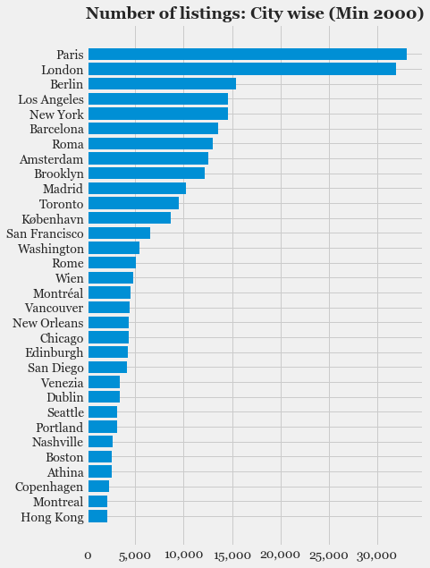
      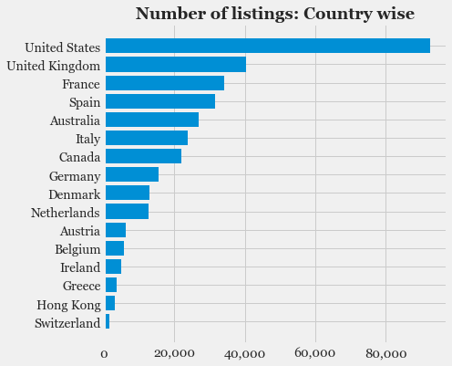 
  </p>
  <p float="left">
      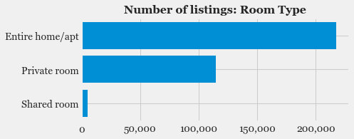
  </p>

  <div class="row">
    <div class="col-lg-8 col-md-10 col-sm-10 col-12 mx-auto">
      <p class="p_no_top_gap">
        Intuitively it is reasonable to expect that the listing location and the listing property type are two of the most important factors in determining the price of the listing. The following plots shows the distribution of listing prices across various cities and the difference in price amongst the three property types.
      </p>
    </div>
  </div>
  
  <p float="left">
      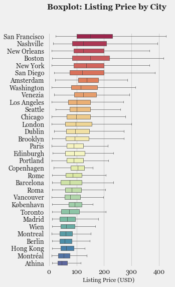
       
  </p>
  <p float="left">
      
  </p>
  
  
  <div class="row">
    <div class="col-lg-8 col-md-10 col-sm-10 col-12 mx-auto">
      <p class="p_no_top_gap">
        Few noticeable observations from the above plots,
        <ul>
          <li>Netherlands, US, Switzerland, Ireland, UK have amongst the highest average listing price.</li>
          <li>In terms of cities, 10 of the top 12 cities with the highest average listing price are in the US. Clearly Airbnb listings are more expensive in the US compared to other European cities.</li>
          <li>As expected, the cities with the highest listing prices are all major tourist attractions. Outside of the US, Amsterdam and Venice are the cities with highest average listing price.</li>
          <li>As expected, <em>Entire homes</em> have the highest prices followed by <em>Private Room</em> and then <em>Shared Rooms</em>.</li>
        </ul>
      </p>
    </div>
  </div>

<div class="row">
        <div class="col-lg-8 col-md-10 col-sm-10 col-12 mx-auto">
          <h2>Feature Engineering: What features will be useful in predicting the listing price ?</h2>
        </div>
      </div>

  <div class="row">
    <div class="col-lg-8 col-md-10 col-sm-10 col-12 mx-auto">
      <p>
        Although the dataset consists of large number of features for listings, not all of them will help in predicting the listing price. In fact, different features will have different influences in .Feature Engineering refers to selecting a subset of features or adding new features which will aid in better prediction of the response variable which is the <em>Listing Price</em> in this project. 
      </p>
      <p>
        The following figures show the distribution of various features against the listing price. This will aid in determining which features are correlated with the listing price and can thereby result in the Models making better predictions.
      </p>
    </div>
  </div>

  <p float="left">
      
       
  </p>
  <p float="left">
      
       
  </p>
  <p float="left">
      
      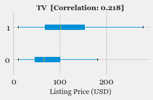 
  </p>
  <p float="left">
      
      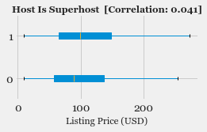 
  </p>
  <p float="left">
      
       
  </p>

  <div class="row">
    <div class="col-lg-8 col-md-10 col-sm-10 col-12 mx-auto">
      <p class="p_no_top_gap">
        As expected, the most important factors that determine the price of a listing are <em>Number of people accommodated</em>, <em>Number of bedrooms</em>, <em>Number of beds</em>, all of which have a Pearson's Correlation Factor of more about 0.45 with the <em>Listing Price</em>. Amenities like TV, AC also show a slight positive correlation. But it is clear that there are no hidden features which plays a major role in determining the listing price, bigger the home/apartment with more bedrooms and beds, higher is the listing price.
      </p>
    </div>
  </div>

  <div class="row">
        <div class="col-lg-8 col-md-10 col-sm-10 col-12 mx-auto">
          <h2>Data pre-processing and cleaning</h2>
        </div>
      </div>

  <div class="row">
    <div class="col-lg-8 col-md-10 col-sm-10 col-12 mx-auto">
      <p class="p_no_top_gap">
        Before feeding these features as input to the Machine Learning Model, the data will need to be pre-processed and cleaned. The following block diagram shows the Data Pipeline with the operations involved in pre-processing and data splitting.
      </p>
    </div>
  </div>

  <div class="row">
    <div class="col-lg-5 col-md-8 col-sm-10 col-11 mx-auto image_top">
      
    </div>
  </div>

  <div class="row">
    <div class="col-lg-8 col-md-10 col-sm-10 col-12 mx-auto">
      <h3 class="sub-title">Data Pre-processing</h3>
    </div>
  </div>

  <div class="row">
    <div class="col-lg-8 col-md-10 col-sm-10 col-12 mx-auto">
      <p class="p_no_top_gap">
        The pre-processing operations involved are listed in the following table.
      </p>
      <table class="table table-sm table-bordered table-hover">
        <thead>
          <tr>
            <th scope="col">Name</th>
            <th scope="col">Feature Type</th>
            <th scope="col">Operation</th>
          </tr>
        </thead>
        <tbody>
          <tr>
            <th scope="row">Imputer</th>
            <td>Numerical</td>
            <td>Replace NULL values with Median</td>
          </tr>
          <tr>
            <th scope="row">Standard Scaler </th>
            <td>Numerical</td>
            <td>Standardise input data to have 0 mean and unit variance</td>
          </tr>
          <tr>
            <th scope="row">Ordinal Encoder</th>
            <td>Categorical</td>
            <td>Encode discrete values into integers</td>
          </tr>
        </tbody>
      </table>
      <p>
        The following code snippet shows the pre-processing pipeline implemented using the Python library <em>Scikit learn</em>.
      </p>
    </div>
  </div>

```
# Preprocessing pipeline for Numerical and Categorical features

from sklearn.pipeline import Pipeline
from sklearn.preprocessing import StandardScaler
from sklearn.preprocessing import OrdinalEncoder
from sklearn.compose import ColumnTransformer


############ Pipeline for numerical features #############
# Numerical features
numerical_attribs = [   'Accommodates', 'Bedrooms', 'Beds', 'Minimum Nights',
             'Availability 30', 'Availability 60', 'Availability 90',
             'Availability 365', 'Number of Reviews', 'Reviews per Month',
             'Review Scores Rating', 'Review Scores Accuracy', 'Review Scores Cleanliness',
             'Review Scores Checkin', 'Review Scores Communication', 'Review Scores Location',
             'Review Scores Value', 'Host Response Rate']

# Pipeline for numerical features
# 1. SimpleImputer: Replace NULL values with median
# 2. FunctionTransformer: Add extra features
# 3. StandardScaler: Normalise values
numerical_pipeline = Pipeline([
        ('imputer', SimpleImputer(strategy="median")), 
        ('attribs_adder', FunctionTransformer(add_extra_features, validate=False)),
        ('std_scaler', StandardScaler()),
    ])


########## Pipeline for categorical features #############
# Categorical features
categorical_attribs = ["Country", "City", "Neighbourhood Cleansed",
                    "Property Type", "Room Type", "Bed Type", "Cancellation Policy",
                    "Host Response Time"]

# OrdinalEncoder(): Encode categorical features as integers
categorical_pipeline = Pipeline([
                            ('ordinal_encoder', OrdinalEncoder()),
                            ])


########## Combined Pipeline for all features ############
preprocessing_pipeline = ColumnTransformer([
        ("categorical", categorical_pipeline, categorical_attribs),
        ("numerical", numerical_pipeline, numerical_attribs),
    ])

# Labels
label = ["Price"]

# Combine numerical and categorical features
df_attribs = df[categorical_attribs + numerical_attribs + label].copy()
# Fit Preprocessing pipeline
df_prepared = preprocessing_pipeline.fit_transform(df[categorical_attribs + numerical_attribs])

# Save preprocessing pipeline
save_model(model=preprocessing_pipeline, save_path="preprocessing_pipeline.pkl")
```

  <div class="row">
    <div class="col-lg-8 col-md-10 col-sm-10 col-12 mx-auto">
      <p>
        After pre-processing, the dataset is divided into 3 splits the details of which are listed in the following table.
      </p>
    </div>
  </div>

  <div class="row">
    <div class="col-lg-8 col-md-10 col-sm-10 col-12 mx-auto">
      <table class="table table-sm  table-bordered table-hover">
        <thead>
          <tr>
            <th scope="col">Data</th>
            <th scope="col">Purpose</th>
            <th scope="col">Split Ratio</th>
            <th scope="col">Number of Samples</th>
          </tr>
        </thead>
        <tbody>
          <tr>
            <th scope="row">Training</th>
            <td>To fit Model</td>
            <td>0.8</td>
            <td>270,058</td>
          </tr>
          <tr>
            <th scope="row">Validation</th>
            <td>To tune hyperparameters</td>
            <td>0.1</td>
            <td>33,757</td>
          </tr>
          <tr>
            <th scope="row">Test</th>
            <td>To evaluate model performance</td>
            <td>0.1</td>
            <td>33,757</td>
          </tr>
        </tbody>
      </table>
    </div>
  </div>

  <div class="row">
        <div class="col-lg-8 col-md-10 col-sm-10 col-12 mx-auto">
          <h2>Modeling: Training Machine learning models, Model Selection</h2>
        </div>
      </div>

  <div class="row">
    <div class="col-lg-8 col-md-10 col-sm-10 col-12 mx-auto">
      <h3 class="sub-title">Model Evaluation Metric</h3>
    </div>
  </div>

  <div class="row">
    <div class="col-lg-8 col-md-10 col-sm-10 col-12 mx-auto">
      <p class="p_no_top_gap">
        Since this is a Regression task (predicting the price of listing), various evaluation metrics such as <em>Variance Explained Score</em>, <em>Mean Absolute Error</em>, <em>R2-score</em>, <em>RMSE (Root Mean Squared Error)</em> can be used. In this project, <em>RMSE</em> is used to evaluate and compare different Machine Learning Models.
      </p>
    </div>
  </div>

  <div class="row">
    <div class="col-lg-8 col-md-10 col-sm-10 col-12 mx-auto">
      <h3 class="sub-title">Regression Models</h3>
    </div>
  </div>

  <div class="row">
    <div class="col-lg-8 col-md-10 col-sm-10 col-12 mx-auto">
      <p class="p_no_top_gap">
        The following Regression Models were explored in this project,
        <ul>
          <li>
            Baseline Models
            <ul>
              <li>Average Neighbourhood Price</li>
              <li>K-Nearest Neighbours Regression</li>
            </ul>
          </li>
          <li>Linear Regression</li>
          <li>Decision Tree Regression</li>
          <li>Random Forest Regression</li>
          <li>XGBoost Regression</li>
        </ul>
      </p>
    </div>
  </div>

  <div class="row">
    <div class="col-lg-8 col-md-10 col-sm-10 col-12 mx-auto">
      <h3 class="subtitle">Baseline Models</h3>
      <p>
        Before trying various Machine Learning Models, it is important to set baseline performances based on simple heuristics or simple models. Accordingly the following two models were used as baseline to compare the other Machine Learning Models.
        <ul>
          <li><b>Average Neighbourhood Price</b>: Estimate the listing price to be the average price of all the listings in the neighbourhood.</li>
          <li><b>K-Nearest Neighbours Regression</b>: As defined <a href="https://scikit-learn.org/stable/modules/generated/sklearn.neighbors.KNeighborsRegressor.html"></a>, the target is predicted by local interpolation of the targets associated of the k-nearest neighbors in the training set.
          </li>
        </ul>
      </p>
    </div>
  </div>

  <div class="row">
    <div class="col-lg-8 col-md-10 col-sm-10 col-12 mx-auto">
      <h3 class="subtitle">Linear Regression</h3>
    </div>
  </div>

  <div class="row">
    <div class="col-lg-8 col-md-10 col-sm-10 col-12 mx-auto">
      <p class="no_top_gap">
        As defined <a href="https://scikit-learn.org/stable/modules/linear_model.html">here</a>, LinearRegression fits a linear model to minimize the residual sum of squares between the observed targets in the dataset, and the targets predicted by the linear approximation.
      </p>
    </div>
  </div>

  <div class="row">
    <div class="col-lg-8 col-md-10 col-sm-10 col-12 mx-auto">
      <h5 class="sub-title">Linear Regression: Feature Importance</h5>
    </div>
  </div>

  <div class="row">
    <div class="col-lg-8 col-md-10 col-sm-10 col-12 mx-auto">
      <p class="no_top_gap">
        The Importance of features as determined by the Linear Regression coefficients is shown in the following plot. As expected <em>Room Type</em>, <em>Number of people accommodated</em> and <em>Number of bedrooms</em> are the most important features in determining the price of the listing.
      </p>
    </div>
  </div>

  <div class="row">
    <div class="col-lg-6 col-md-8 col-sm-10 col-10 mx-auto image_top">
      
    </div>
  </div>

  <div class="row">
    <div class="col-lg-8 col-md-10 col-sm-10 col-12 mx-auto">
      <h5 class="sub-title">Linear Regression: Model Learning, Performance and Stability</h5>
    </div>
  </div>

  <div class="row">
    <div class="col-lg-8 col-md-10 col-sm-10 col-12 mx-auto">
      <p class="p_no_top_gap">
        The following code snippet shows how <em>Scikit Learn</em>'s <em>learning_curve</em> method can be used to study the Model learning, performance and stability.
      </p>
    </div>
  </div>

```
from sklearn.model_selection import learning_curve

# sklearn's learning_curve function can be used for following purposes
# 1. Learning curve: To study how training and validation error varies with more training examples
#      train_scores, valid_scores vs train_sizes
# 2. Model scalability: To study the time required to fit model as training data size increases
#      fit_times vs train_sizes
# 3. Model performance: To study how training error changes with time required to fit
#      train_scores vs fit_times

train_sizes, train_scores, valid_scores, fit_times, score_times = learning_curve(model, df_features, df_labels,
                                                                                 train_sizes=[0.25, 0.5, 0.75, 1], cv=10,
                                                                                 scoring="neg_mean_squared_error", 
                                                                                 return_times=True)
```

  <div class="row">
    <div class="col-lg-8 col-md-10 col-sm-10 col-12 mx-auto">
      <p class="p_no_top_gap">
        The learning, performance and stability for the <em>Linear Regression</em> Model are shown in the following figures. Learning curve shows how the Model predictions improve as it sees more training examples. The fact that the training and validation RMSE converge to similar value, shows that the Model is not overfitting.
      </p>
    </div>
  </div>

<p float="left">
  
   
  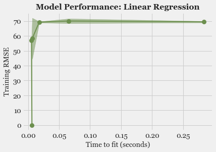
</p>


  <div class="row">
    <div class="col-lg-8 col-md-10 col-sm-10 col-12 mx-auto">
      <p>
        Model scalability can be studied by plotting the time it takes to fit the Model as the number of training examples increases. The Model performance can be examined by plotting the Model Evaluation Metric (RMSE) against the time it takes to fit the Model. Together these curves will be very useful in comparing various Models and selecting a final Model for predictions.
      </p>
    </div>
  </div>

  <div class="row">
    <div class="col-lg-8 col-md-10 col-sm-10 col-12 mx-auto">
      <h3 class="subtitle">Decision Tree Regressor</h3>
    </div>
  </div>

  <div class="row">
    <div class="col-lg-8 col-md-10 col-sm-10 col-12 mx-auto">
      <h5 class="sub-title">Decision Tree Regressor: Feature Importance</h5>
    </div>
  </div>

  <div class="row">
    <div class="col-lg-8 col-md-10 col-sm-10 col-12 mx-auto">
      <p class="no_top_gap">
        The following figure shows the Top5 features sorted by the <em>Feature Importance</em> as determined by the <em>Decision Tree Regressor</em>. As expected, the number of bedrooms, people accommodated, room type and location of the listing (country, city) are the most important features in determining the listing price.
      </p>
    </div>
  </div>

  <div class="row">
    <div class="col-lg-4 col-md-8 col-sm-10 col-10 mx-auto image_top">
      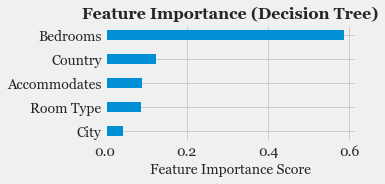
    </div>
  </div>

  <div class="row">
    <div class="col-lg-8 col-md-10 col-sm-10 col-12 mx-auto">
      <h5 class="sub-title">Decision Tree Regressor: Hyper-parameter tuning</h5>
    </div>
  </div>

  <div class="row">
    <div class="col-lg-8 col-md-10 col-sm-10 col-12 mx-auto">
      <p class="no_top_gap">
        In order to get the best possible results from any Model, it is vital to determine the right combination of hyper-parameters to be used. This process is known as hyper-parameter tuning. It involves training the Model with different values for a set of parameters. The Model performance is then computed using the Validation Dataset. The parameter combination which yields the best performance is the one that will eventually be selected while comparing various Models. The code snippet to do this using <em>Grid Search</em> and <em>Randomized Search</em> Cross Validation is shown here,
      </p>
    </div>
  </div>

```
# Tune hyperparameters using Grid search and Randomised search Cross Validation

from sklearn.model_selection import cross_val_score
from sklearn.model_selection import GridSearchCV
from sklearn.model_selection import RandomizedSearchCV

# Grid Search Cross Validation
# Specify discrete values for hyperparameters
param_grid = [
    {'max_depth': [1, 20, 100], 'max_features': [1, 5, 15, 20],
     'max_leaf_nodes': [5, 50, 100]},
]
search = GridSearchCV(estimator=model, param_grid=param_grid, cv=10,
                      scoring='neg_mean_squared_error', return_train_score=True)

# Randomised search Cross Validation
# Specify distribution for hyperparameters
param_distribs = {
  'max_depth': randint(low=1, high=10),
  'max_features': randint(low=1, high=20),
}
search = RandomizedSearchCV(estimator=model, param_distributions=param_distributions,
                            n_iter=5, cv=10, scoring='neg_mean_squared_error',
                            random_state=42, return_train_score=True)
```

  <div class="row">
    <div class="col-lg-8 col-md-10 col-sm-10 col-12 mx-auto">
      <p>
        To determine the best possible values for parameters of <em></em>, the following different values of parameters were tried using <em>Grid Search</em> Cross Validation. 
      </p>
      <table class="table table-sm table-bordered table-hover">
        <thead>
          <tr>
            <th scope="col">Hyper-parameter</th>
            <th scope="col">Values</th>
          </tr>
        </thead>
        <tbody>
          <tr>
            <th scope="row">Maximum Depth</th>
            <td>[1, 20, 100]</td>
          </tr>
          <tr>
            <th scope="row">Maximum Number of Features</th>
            <td>[1, 5, 15, 20]</td>
          </tr>
          <tr>
            <th scope="row">Maximum number of leaf nodes</th>
            <td>[5, 50, 100]</td>
          </tr>
        </tbody>
      </table>
      <p>
        The best estimator for <em></em> was determined to be with the following values of hyper-parameters, <em>Max Depth=20</em> , <em>Max Features=20</em> and <em>Max Leaf Nodes=100</em>.
      </p>
    </div>
  </div>

<p float="left">
  
  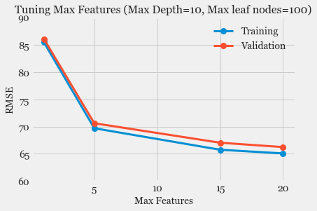 
  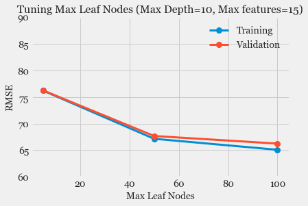
</p>

  <div class="row">
    <div class="col-lg-8 col-md-10 col-sm-10 col-12 mx-auto">
      <h5 class="sub-title">Decision Tree: Learning Curve, Model Scalability and Performance</h5>
    </div>
  </div>

<p float="left">
  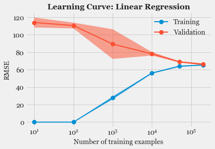
   
  
</p>


  <div class="row">
    <div class="col-lg-8 col-md-10 col-sm-10 col-12 mx-auto">
      <h2>Model Evaluation and Comparison</h2>
      <p>
        The final step of Model Selection is to compare the Prediction RMSE of all the tuned classifiers on Test Dataset. In this step, it is important to consider not just the <em>Mean or Median RMSE</em>, instead consider the entire range of RMSE obtained over different samples in the Test Dataset or over different splits of Cross Validation Data. The box plots of <em>RMSE on Test DaTa</em> for different Regression Models are shown in the following plot,
      </p>
    </div>
  </div>

  <div class="row">
    <div class="col-lg-6 col-md-8 col-sm-10 col-10 mx-auto image_top">
      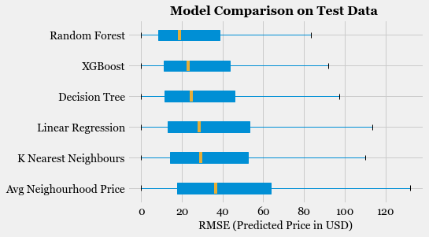
    </div>
  </div>

  <div class="row">
    <div class="col-lg-8 col-md-10 col-sm-10 col-12 mx-auto">
      <p>
        It can be observed that amongst the Models considered here, <em>Random Forest</em> seems to be the one with the lowest Median RMSE, also with the lowest <em>IQR (Inter-Quartile Range)</em>. The Median RMSE error for <em>Random Forest</em> is less than 20 USD, so the Model is successful to a large extent in predicting the price of the listing.
      </p>
    </div>
  </div>

  <div class="row">
        <div class="col-lg-8 col-md-10 col-sm-10 col-12 mx-auto">
          <h2>Deployment, Serving and Production: CI/CD Pipeline</h2>
        </div>
      </div>

  <div class="row">
    <div class="col-lg-8 col-md-10 col-sm-10 col-12 mx-auto">
      <h3 class="sub-title">Model deployment using FLASK Application</h3>
    </div>
  </div>

  <div class="row">
    <div class="col-lg-8 col-md-10 col-sm-10 col-12 mx-auto">
      <p class="p_no_top_gap">
        A FLASK Webapp is developed in order to serve the Model Predictions and showcase the capabilites of the project. The following code block shows how the model is used to get inference for a given input image. 
      </p>
    </div>
  </div>

```
# FLASK Webapp for serving price Predictions for Airbnb listings 
import os, sys
sys.path.append(".")
import webapp_predict_price

import pickle
from flask import Flask
import flask
import sklearn
import joblib
import pandas as pd

# Load pre-trained machine learning model.
BASE_PATH = "webapp_predict_price/"
model = joblib.load(BASE_PATH + "best_model.pkl")


def create_app(test_config=None):
    # create and configure the app
    app = Flask(__name__, instance_relative_config=True)
    app.config.from_mapping(
        SECRET_KEY='dev',
        #DATABASE=os.path.join(app.instance_path, 'flaskr.sqlite'),
    )

    if test_config is None:
        # load the instance config, if it exists, when not testing
        app.config.from_pyfile('config.py', silent=True)
    else:
        # load the test config if passed in
        app.config.from_mapping(test_config)

    # ensure the instance folder exists
    try:
        os.makedirs(app.instance_path)
    except OSError:
        pass

    # Landing page
    @app.route('/', methods=['GET', 'POST'])
    def hello():
        # return 'Hello, World!'
        
        # Return landing page
        if flask.request.method == 'GET':
            return(flask.render_template('base.html'))

        # Return prediction output
        if flask.request.method == 'POST':

            # Create input to Model from form data
            df_input = pd.DataFrame([[country, city, neighbourhood, propertytype, roomtype, bedtype,
                                    cancellationpolicy, hostresponsetime, accommodates, num_bedrooms, num_beds,
                                    min_nights, availability_30, availability_60, availability_90, availability_365,
                                    num_reviews, reviews_per_month, review_scores_rating, review_scores_accuracy, 
                                    review_scores_cleanliness, review_scores_checkin, review_scores_communication,
                                    review_scores_location, review_scores_value, host_response_rate,
                                    ]], dtype=float)

            # Inference: Get prediction from Model
            prediction_price = model.predict(df_input)[0]
            prediction_price = round(prediction_price)

            return(flask.render_template('base.html', result=prediction_price))

    return app


# if this is the main thread of execution first load the model and
# then start the server
if __name__ == "__main__":
    print(("* Loading Scikit-learn model and Flask starting server..."
        "please wait until server has fully started"))
    app = create_app()
    app.run(host='0.0.0.0', port=5000)
```

  <div class="row">
    <div class="col-lg-8 col-md-10 col-sm-10 col-12 mx-auto">
      <h3 class="sub-title">Serving Model Predictions: REST API as Web Service</h3>
    </div>
  </div>
  <div class="row">
    <div class="col-lg-8 col-md-10 col-sm-10 col-12 mx-auto">
      <p class="p_no_top_gap">
        The Model predictions can also be served as a Web Service by using REST API. The following code snippet shows how this can be accomplished. The model output is returned as a JSON object.
      </p>
    </div>
  </div>

```
# REST API Service to get Price Predictions for Airbnb listings
@app.route("/predict", methods=["POST"])
def predict():
    
    # initialize the data dictionary that will be returned from the view
    data = {"success": False}

    # ensure an image was properly uploaded to our endpoint
    if flask.request.method == "POST":
        data["predictions"] = []

        parser = reqparse.RequestParser()
        parser.add_argument('country', type=str, help='Country')
        parser.add_argument('city', type=str, help='City')
        parser.add_argument('neighbourhood', type=str, help='Neighbourhood')
        parser.add_argument('roomtype', type=str, help='Room type')
        args = parser.parse_args()

        # Create input to Model from form data
        df_input = pd.DataFrame([[country, city, neighbourhood, propertytype, roomtype, bedtype,
                            cancellationpolicy, hostresponsetime, accommodates, num_bedrooms, num_beds,
                            min_nights, availability_30, availability_60, availability_90, availability_365,
                            num_reviews, reviews_per_month, review_scores_rating, review_scores_accuracy, 
                            review_scores_cleanliness, review_scores_checkin, review_scores_communication,
                            review_scores_location, review_scores_value, host_response_rate,
                            ]], dtype=float)

        # Inference: Get prediction from Model
        prediction_price = model.predict(df_input)[0]
        prediction_price = round(prediction_price)

        # Add prediction results to JSON data
        r = {"prediction_price": prediction_price, "features": features}
        data["predictions"].append(r)
        # indicate that the request was a success
        data["success"] = True

    # return the data dictionary as a JSON response
    return flask.jsonify(data)
```

  <div class="row">
    <div class="col-lg-8 col-md-10 col-sm-10 col-12 mx-auto">
      <p class="p_no_top_gap">
        The following figure shows how the Model predictions can be obtained using the above REST API.
      </p>
    </div>
  </div>
  <div class="row image_row">
    <div class="col-lg-8 col-md-10 col-sm-10 col-10 mx-auto">
      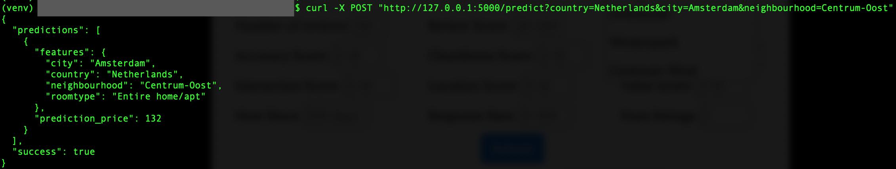
    </div>
  </div>


  <div class="row">
    <div class="col-lg-8 col-md-10 col-sm-10 col-12 mx-auto">
      <h3 class="sub-title">Model in Production: FLASK, Docker, AWS CI/CD Pipeline</h3>
    </div>
  </div>

  <div class="row">
    <div class="col-lg-8 col-md-10 col-sm-10 col-10 mx-auto image_top">
      
    </div>
  </div>

  <div class="row">
    <div class="col-lg-8 col-md-10 col-sm-10 col-12 mx-auto">
      <p class="p_no_top_gap">
        The production pipeline consists of the following components,
        <ul>
          <li><b>FLASK Webapp</b>: Webapp and REST API to serve Model Predictions</li>
          <li><b>Docker</b>: Containersied FLASK Webapp which can then be deployed in any environment</li>
          <li><b>AWS</b>: CI/CD Pipeline</li>
          <ul>
            <li><b>ECR Repository</b>: The Docker Image is stored in this repository. Any changes to this image will trigger changes in the rest of the pipeline and the updates to the image will then be deployed to the Web Application.</li>
            <li><b>CodeCommit </b>: The pipeline is configured to use a source location where the following two files are stored,
              <ul>
                <li><b>Amazon ECS Task Definition file</b>: The task definition file lists Docker image name, container name, Amazon ECS service name, and load balancer configuration.</li>
                <li><b>CodeDeploy AppSpec file</b>: This specifies the name of the Amazon ECS task definition file, the name of the updated application's container, and the container port where CodeDeploy reroutes production traffic.</li>
              </ul>
            <li><b>CodeDeploy</b>: Used during deployment to reference the correct deployment group, target groups, listeners and traffic rerouting behaviour. CodeDeploy uses a listener to reroute traffic to the port of the updated container specified in the AppSpec file
              <ul>
                <li><b>ECS Cluster</b>: Cluster where CodeDeploy routes traffic during deployment</li>
                <li><b>Load Balancer</b>: The load balancer uses a VPC with two public subnets in different Availability Zones.</li>
              </ul>
            </li>
          </ul>
        </ul>
      </p>
    </div>
  </div>


# Alternate Search Rankings for Airbnb
The project involved coming up with alternate search rankings based on Listing Vibe, Aesthetic Quality of listings photos and using A/B testing for comparing different search rankings.

<div class="row">
        <div class="col-lg-8 col-md-10 col-sm-10 col-12 mx-auto">
          <h2>Project Goals</h2>
        </div>
      </div>

  <div class="row">
    <div class="col-lg-8 col-md-10 col-sm-10 col-12 mx-auto">
      <p>
        Alternate Searches: Come up with novel alternate ways of searching Airbnb lisings with an aim of making it easier for users to find listings of their most appropriate choice.
      </p>
      <ul>
        <li><b>Listings Vibe</b>: Determine vibe of listing based on Topic Modeling on listing description.</li>
        <li><b>Image Aesthetics</b>: Sort listings based on image aesthetics as determined by Deep Learning Image Assessment Model</li>
      </ul>
    </div>
  </div>

<div class="row">
        <div class="col-lg-8 col-md-10 col-sm-10 col-12 mx-auto">
          <h2>About Dataset</h2>
        </div>
      </div>

  <div class="row">
    <div class="col-lg-8 col-md-10 col-sm-10 col-12 mx-auto">
      <p class="p_no_top_gap">
        The Dataset used in this project was obtained from <a href="https://public.opendatasoft.com/explore/dataset/airbnb-listings/table/?disjunctive.host_verifications&disjunctive.amenities&disjunctive.features&dataChart=eyJxdWVyaWVzIjpbeyJjaGFydHMiOlt7InR5cGUiOiJjb2x1bW4iLCJmdW5jIjoiQ09VTlQiLCJ5QXhpcyI6Imhvc3RfbGlzdGluZ3NfY291bnQiLCJzY2llbnRpZmljRGlzcGxheSI6dHJ1ZSwiY29sb3IiOiJyYW5nZS1jdXN0b20ifV0sInhBeGlzIjoiY2l0eSIsIm1heHBvaW50cyI6IiIsInRpbWVzY2FsZSI6IiIsInNvcnQiOiIiLCJzZXJpZXNCcmVha2Rvd24iOiJyb29tX3R5cGUiLCJjb25maWciOnsiZGF0YXNldCI6ImFpcmJuYi1saXN0aW5ncyIsIm9wdGlvbnMiOnsiZGlzanVuY3RpdmUuaG9zdF92ZXJpZmljYXRpb25zIjp0cnVlLCJkaXNqdW5jdGl2ZS5hbWVuaXRpZXMiOnRydWUsImRpc2p1bmN0aXZlLmZlYXR1cmVzIjp0cnVlfX19XSwidGltZXNjYWxlIjoiIiwiZGlzcGxheUxlZ2VuZCI6dHJ1ZSwiYWxpZ25Nb250aCI6dHJ1ZX0%3D">public.opendatasoft.com</a>. There are a total of 494,954 records each of which contains details of one Airbnb listing. The total size of dataset is 1.89 GB. 
      </p>
      <p class="p_no_top_gap">
        The dataset has a large number of features which can be categorised into following types,
        <ul>
          <li>
            <b>Location related</b>: Country, City, Neighbourhood
          </li>
          <li>
            <b>Property related</b>: Property Type, Room Type, Accommodates, Bedrooms, Beds, Bed Type, Cancellation Policy, Minimum Nights
          </li>
          <li>
            <b>Booking Availability</b>: Availability 30, Availability 60, Availability 90, Availability 365
          </li>
          <li>
            <b>Reviews related</b>: Number of Reviews, Reviews per Month, Review Scores Rating, Review Scores Accuracy, Review Scores Cleanliness, Review Scores Checkin, Review Scores Communication, Review Scores Location, Review Scores Value
          </li>
          <li>
            <b>Host related</b>: Host Since, Host Response Time, Host Response Rate, Calculated host listings count, Host Since Days, Host Has Profile Pic, Host Identity Verified, Is Location Exact, Instant Bookable, Host Is Superhost, Require Guest Phone Verification, Require Guest Profile Picture, Requires License
          </li>
          <li>
            <b>Text Features</b>: Listing Description, House Rules, Neighbourhood Description
          </li>
          <li>
            <b>Image URL</b>: Link to listing image (one per listing)
          </li>
        </ul>
      </p>
    </div>
  </div>

  <div class="row">
    <div class="col-lg-8 col-md-10 col-sm-10 col-12 mx-auto">
      <p>
        For this project, the following features will be used,
        <ul>
          <li>Text Features such as Listing Description, House Rules, Neighbourhood Description in order to determine <em>Listing Vibe</em> based on Topic Modelling.
          <li>Listing Images to search by <em>Image aesthetics</em></li>
        </ul>
      </p>
    </div>
  </div>


<div class="row">
        <div class="col-lg-8 col-md-10 col-sm-10 col-12 mx-auto">
          <h2>Search by Image Aesthetics: Using pre-trained Deep Learning Model to assess image quality</h2>
        </div>
      </div>

  <div class="row">
    <div class="col-lg-8 col-md-10 col-sm-10 col-12 mx-auto doc_image_header">
      <h3 class="sub-title">Why search by image quality and aesthetics ?</h3>
    </div>
  </div>

  <div class="row">
    <div class="col-lg-8 col-md-10 col-sm-10 col-12 mx-auto">
      <p>
        Users of online home listings portal such as Airbnb have to rely solely on information provided by hosts. It is vital that the images posted by the host is clear and an accurate depiction of reality. In this regard, it makes sense that users would want to prefer listings with very good image quality and aesthetics. Currently there is no easy way for users to search by image quality, in this project a deep learning model is used to assess the image posted by hosts. A image quality score is assigned to each image and the users can then sort the listings by this score such that the listings with the best image quality will appear at the top and making it easier for users to find what they are looking for.
      </p>
    </div>
  </div>

  <div class="row">
    <div class="col-lg-8 col-md-10 col-sm-10 col-12 mx-auto doc_image_header">
      <h3 class="sub-title">Pipeline: Search by Image Aesthetics</h3>
    </div>
  </div>

  <div class="row">
    <div class="col-lg-6 col-md-10 col-sm-10 col-11 mx-auto doc_image">
      
    </div>
  </div>

  <div class="row">
    <div class="col-lg-8 col-md-10 col-sm-10 col-12 mx-auto">
      <p>
        The Deep Learning Model used to assess image quality is <a href="https://ai.googleblog.com/2017/12/introducing-nima-neural-image-assessment.html">Google's Neural image assessment model</a>. It is based on Convolutional Neural Networks (CNN). <a href="https://github.com/idealo/image-quality-assessment">This</a> implementation of the model was used to assign scores to photos of listings.
      </p>
    </div>
  </div>


  <div class="row img_block img_block_abtesting">
    <div class="col-lg-12 col-md-12 col-sm-12 col-12 mx-auto">
      <div class="row">
        <div class="col-lg-6 col-md-6 col-12">
          <div class="row">
            <div class="col-lg-12 col-12 image_header">Images with Best Aesthetics</div>
          </div>
          <div class="row">
            <div class="col-lg-12 col-12">
              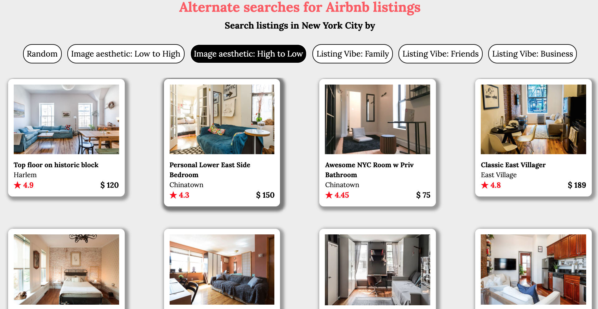
            </div>
          </div>
        </div>
        <div class="col-lg-6 col-md-6 col-12">
          <div class="row">
            <div class="col-lg-12 col-12 image_header">Images with Poor Aesthetics</div>
          </div>
          <div class="row">
            <div class="col-lg-12 col-12">
              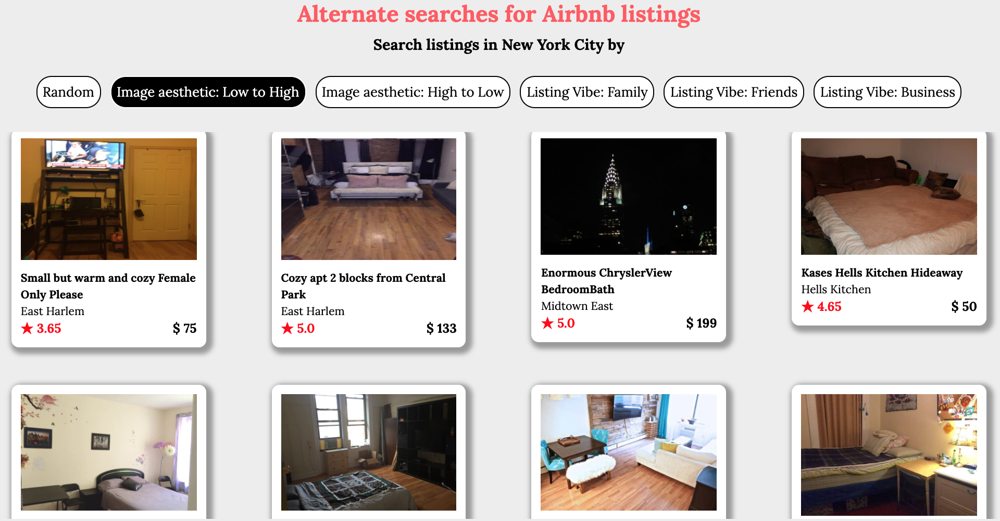
            </div>
          </div>
        </div>
      </div>
    </div>
  </div>

  
  <div class="row">
    <div class="col-lg-8 col-md-10 col-sm-10 col-12 mx-auto">
      <p>
        The results indicate how the Deep Learning model has accurately assigned high aesthetic scores to brightly lit images of rooms with clearly visible amenities. Whereas images shot in low light, with poor clarity are assigned lower scores. This feature would be very useful for users to eliminate such listings and encourage more hosts to upload pictures of better quality.
      </p>
    </div>
  </div>


<div class="row">
        <div class="col-lg-8 col-md-10 col-sm-10 col-12 mx-auto">
          <h2>Classifying listings based on Topic Modeling of listing description</h2>
        </div>
      </div>

  <div class="row">
    <div class="col-lg-8 col-md-10 col-sm-10 col-12 mx-auto doc_image_header">
      <h3 class="sub-title">Why search by <em>Listing Vibe</em> ?</h3>
    </div>
  </div>

  <div class="row">
    <div class="col-lg-8 col-md-10 col-sm-10 col-12 mx-auto">
      <p>
        Airbnb lets users search for listings based on a number of criteria such as <em>Location</em>, <em>Price</em>, <em>Room Type</em>, <em>Number of people accommodated</em>. However one of the aspects missing in this is <em>What type of guests are most welcome in the listing ?</em> Generally Airbnb guests fall in one of the below categories,
        <ul>
          <li><b>Family</b>: Guests looking for accommodation for family vacation. Such guests usually look for a place in good neighbourhood, which is safe for kids amongst other criteria.</li>
          <li><b>Friends</b>: When travelling with friends, some of the important criteria for booking a listing are <em>Tolerance to loud talking</em>, <em>Permission for Parties</em>, <em>Close to restaurants, bars</em> etc</li>
          <li><b>Solo/Budget travel</b>: Typically these guests search for <em>Budget friendly</em> options, even if the place is relatively small and does not include all the amenities.</li>
          <li><b>Business Visit</b>: Guests visiting for Business purposes typically look for a place in <em>Good Neighbourhood</em>,  <em>Close to Downtown</em> for socialising with excellent amenities.</li>
        </ul>
      </p>
      <p>
        However the Airbnb webpage does not support searching listings based on the above characteristics. There is no way for users to search for listings with a particular theme like the ones listed above. One of the objectives of this project is to come up with an option for users to search based on <em>Listing Vibe</em>. The next few sections will describe how this is achieved.
      </p>
    </div>
  </div>


  <div class="row">
    <div class="col-lg-8 col-md-10 col-sm-10 col-12 mx-auto doc_image_header">
      <h3 class="sub-title">Pipeline: Search by Listing vibe</h3>
    </div>
  </div>

  <div class="row">
    <div class="col-lg-8 col-md-10 col-sm-10 col-12 mx-auto">
      <p>The listing descriptions, neighbourhood descriptions for each listing are extracted from the dataset. This will then be fed to NLP Pipeline which converts words and sentences into a set of features. These features will then be used to perform <em>Topic Modelling</em>. This process will generate a set of topics (based on grouping words that have frequently occurred together). Every listing will then be assigned to one of the topics. Users can then filter the listings based on these specific categories.</p>
    </div>
  </div>

  <div class="row">
    <div class="col-lg-6 col-md-10 col-sm-10 col-11 mx-auto doc_image">
      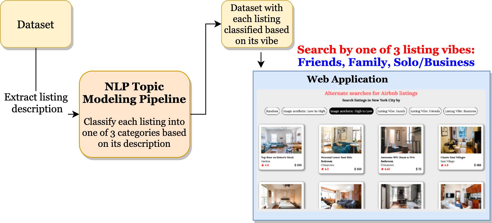
    </div>
  </div>

  <div class="row">
    <div class="col-lg-8 col-md-10 col-sm-10 col-12 mx-auto">
      <h3 class="sub-title">NLP Pipeline for Topic Modelling</h3>
    </div>
  </div>

  <div class="row">
    <div class="col-lg-8 col-md-10 col-sm-10 col-12 mx-auto">
      <p>
         The NLP Pipeline involves converting a sentences into words and then ultimately into set of features which can then serve as input to Machine Learning Model. This process consists of the following steps,
         <ul>
          <li><b>Input</b>: The listing and neighbourhood descriptions will together form Input Data</li>
          <li><b>Tokenise Words</b>: Converts sentences into list of words, removes punctuations.</li>
          <li><b>Stop Words Removal</b>: A lot of words which occur frequently in all the documents do not add much value in extracting useful features. As a result, such words are removed.</li>
          <li><b>Bigrams Models</b>: Identify words that commonly occur together with each other (Example: <em>Art deco</em>. In addition to individual words, these serve as additional features.</li>
          <li><b>Lemmatization</b>: Reducing various inflected forms of a word to the basic root word. For example, after this transformation the word <em>located</em> will be reduced to <em>locate</em>.</li>
          <li><b>Term Document Frequency</b>: Counts the number of occurrences of each word in every document.</li>
          <li><b>Topic Modelling using Latent Dirichet Allocation (LDA) Model</b>: The corpus of Id to Word Mapping, number of occurrences of various words in each of the documents will serve as inputs to the LDA Model which will then generate a predefined number of distinct topics based on grouping of similar words which would have occurred together across different documents.</li>
         </ul>
      </p>
    </div>
  </div>

  <div class="row">
    <div class="col-lg-8 col-md-10 col-sm-10 col-11 mx-auto doc_image">
      
    </div>
  </div>

  <div class="row">
    <div class="col-lg-8 col-md-10 col-sm-10 col-12 mx-auto">
      <h3 class="sub-title">Topic Modelling: Identifying and Labelling Topics</h3>
    </div>
  </div>

  <div class="row">
    <div class="col-lg-8 col-md-10 col-sm-10 col-12 mx-auto">
      <p>
         The LDA Model will return the predefined <em>Number of Topics</em> set of closely related words. After processing the Airbnb Listings and Neighbourhood description through the above pipeline, the following set of words were returned,
         <br>
         <br>
         <code>
          [(0,
            '0.036*"walk" + 0.031*"restaurant" + 0.027*"block" + 0.025*"place" + '
            '0.025*"train" + 0.024*"away" + 0.024*"subway" + 0.022*"minute" + '
            '0.021*"close" + 0.019*"good"'),
           (1,
            '0.021*"guest" + 0.020*"stay" + 0.015*"space" + 0.015*"share" + '
            '0.014*"available" + 0.014*"home" + 0.012*"use" + 0.012*"private" + '
            '0.012*"access" + 0.011*"need"'),
           (2,
            '0.028*"full" + 0.022*"large" + 0.018*"size" + 0.014*"tv" + 0.014*"private" '
            '+ 0.013*"include" + 0.013*"fully" + 0.011*"space" + 0.011*"building" + '
            '0.011*"high"')]
         </code>
      </p>
      <p>
        It is now up to the ML practitioner to assign individual labels to each set of these words. Since the objective in this project is to assign <em>Listing Vibe</em>, the following figure shows the topics that were assigned based on the words present in each group.
      </p>
    </div>
  </div>

  <div class="row">
    <div class="col-lg-8 col-md-10 col-sm-10 col-11 mx-auto doc_image">
      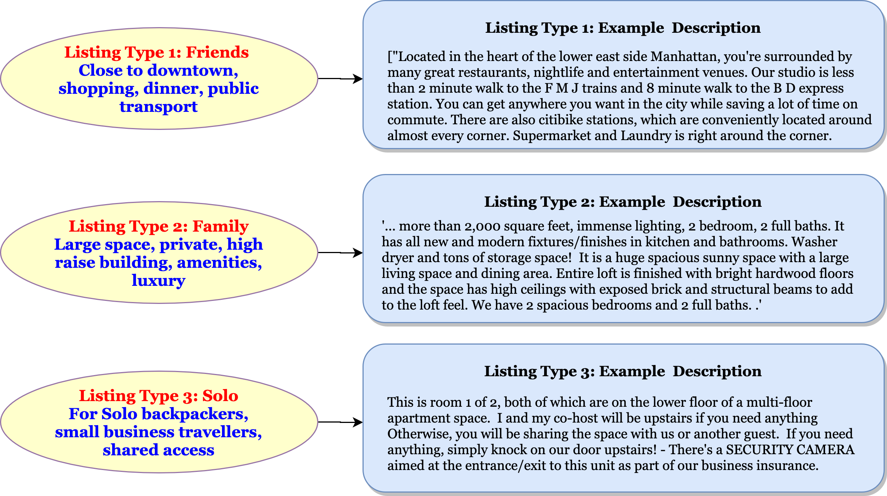
    </div>
  </div>

  <div class="row">
    <div class="col-lg-8 col-md-10 col-sm-10 col-12 mx-auto">
      <p>The above figure also shows an example listing description for each of the three topics that were assigned. It is interesting to note that the LDA Model did return 3 sets of words which roughly correspond to the three types of listings that were mentioned earlier: <em>Family/Kids</em>, <em>Friends</em>, <em>Solo, Business Visits/</em>.</p>
    </div>
  </div>
  

  <div class="row">
    <div class="col-lg-8 col-md-10 col-sm-10 col-12 mx-auto">
      <h3 class="sub-title">Topic Modeling: Visualisation</h3>
    </div>
  </div>

  <div class="row">
    <div class="col-lg-8 col-md-10 col-sm-10 col-12 mx-auto">
      <p>The following screen capture shows the visualisation of the 3 topics. This was done using the <a href="https://pyldavis.readthedocs.io/en/latest/readme.html"></a> library. Each circle corresponds to a topic. The three big circles in different quadrants indicate that the topics identified are specific and distinct. Hovering on each topic (circle) will show the most dominant words present in that topic.</p>
    </div>
  </div>


  <div class="row">
    <div class="col-lg-8 col-md-10 col-sm-10 col-12 mx-auto doc_gif">
      
    </div>
  </div>


  <div class="row">
    <div class="col-lg-8 col-md-10 col-sm-10 col-12 mx-auto">
      <h3 class="sub-title">Screenshot: Search by <em>Listing Vibe</em></h3>
    </div>
  </div>

  <div class="row">
    <div class="col-lg-8 col-md-10 col-sm-10 col-12 mx-auto">
      <p>The following screen capture of the Webapp illustrates how search by <em>Listing Vibe</em> works. Users can now filter listings based on the <em>Topic</em> assigned to each listing. This should hopefully add a new dimension to searching for accommodation, make it easier to find the type of listings user is looking for, thereby reduce the booking time and improve the conversion rate.</p>
    </div>
  </div>

  <div class="row">
    <div class="col-lg-8 col-md-10 col-sm-10 col-12 mx-auto">
      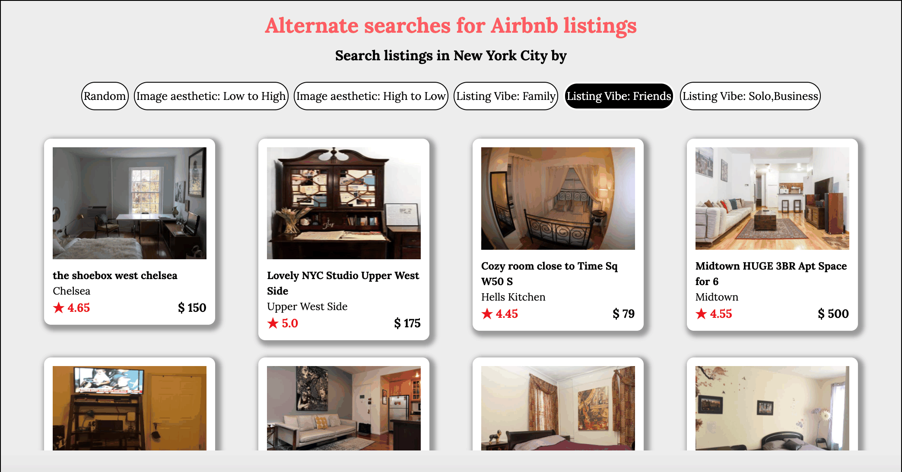
    </div>
  </div>


<div class="row">
        <div class="col-lg-8 col-md-10 col-sm-10 col-12 mx-auto">
          <h2>How to study the effectiveness of newly added search features ? - A/B Testing</h2>
        </div>
      </div>

  <div class="row">
    <div class="col-lg-8 col-md-10 col-sm-10 col-12 mx-auto">
      <h3 class="sub-title">A/B Testing: What is it and its purpose ?</h3>
    </div>
  </div>

  <div class="row">
    <div class="col-lg-8 col-md-10 col-sm-10 col-12 mx-auto">
      <p>
        So far this project introduced two alternate ways of searching for listings on Airbnb namely,
        <ul>
          <li><b>Sort listings by Image Aesthetics</b></li>
          <li><b>Search by Listing Vibe</b></li>
        </ul>
        The next obvious question is how can we test the effectiveness of these newly introduced features ? The answer to this is through a process called <b>A/B Testing</b>, which can be used to compare the existing version of the website against the version with the newly introduced changes. The methodology used is described in the following section.
      </p>
    </div>
  </div>

  <div class="row">
    <div class="col-lg-8 col-md-10 col-sm-10 col-12 mx-auto">
      <h3 class="sub-title">A/B Testing Methodology: How to do it ?</h3>
    </div>
  </div>

  <div class="row">
    <div class="col-lg-8 col-md-10 col-sm-10 col-12 mx-auto">
      <p>
        The A/B Testing methodology consists of following steps, each of which are described in detail in the following sections.
      </p>
      <ul>
        <li><b>Research, Define Goals and Set up Metrics</b></li>
        <li><b>Hypothesis Formulation</b></li>
        <li><b>Create Variation</b></li>
        <li><b>Run A/B (Split) Testing</b></li>
        <li><b>Collecting Data and Statistical Analysis</b></li>
        <li><b>Analyse Results and Draw Conclusions</b></li>
      </ul>
    </div>
  </div>

  <div class="row">
    <div class="col-lg-6 col-md-10 col-sm-10 col-11 mx-auto doc_image">
      
    </div>
  </div>

  <div class="row">
    <div class="col-lg-8 col-md-10 col-sm-10 col-12 mx-auto">
      <h5 class="sub-title">Step 1: Research, Define Goals and Set up Metrics</h5>
    </div>
  </div>
  
  <div class="row">
    <div class="col-lg-8 col-md-10 col-sm-10 col-12 mx-auto">
      <p>
        The first step before getting started on A/B Testing is to do prior research. To study how the current website works, insepct how effective the current features are. To serve this purpose, a number of metrics should be logged and monitored: <em>Number of site visitors</em>, <em>Amount of time taken in various pages</em>, <em>Time to Booking</em>, <em>Conversion Rate</em> (Fraction of total users completing a booking). 
      </p>
      <p>
        The above analysis and the metrics collected will help in understanding which parts of the website can be improved in order to increase sales or engagement. Based on this, a few specific metrics can be chosen to be improved through A/B Testing. For this project, the following metrics were chosen to be optimised,
        <ul>
          <li>Time to complete booking</li>
          <li>Conversion Rate</li>
        </ul>
      </p>
    </div>
  </div>

  <div class="row">
    <div class="col-lg-8 col-md-10 col-sm-10 col-12 mx-auto">
      <h5 class="sub-title">Step 2: Hypothesis Formulation</h5>
    </div>
  </div>

  <div class="row">
    <div class="col-lg-8 col-md-10 col-sm-10 col-12 mx-auto">
      <p>
        The next step is to formulate hypothesis. For every metric we want to improve on, a <em>Null</em> and an <em>Alternate</em> Hypothesis need to be introduced. The <em>Null Hypothesis</em> indicates that the newly introduced feature did not make any change compared to the existing version whereas the <em>Alternate Hypothesis</em> suggests that there was a change in metrics (may be better or worse) due to the newly introduced feature. For the two metrics chosen in this project, following are the <em>Null Hypothesis</em> and <em>Alternate Hypothesis</em>.
        <ul>
          <li><b>Hypothesis 1: Time to complete booking</b>
            <ul>
              <li><b>Null Hypothesis</b>: Mean time to complete booking is the same for both control and variation</li>
              <li><b>Alternate Hypothesis</b>: Mean time to complete booking is different for control and variation</li>
            </ul>
          </li>
          <li><b>Hypothesis 2: Conversion Rate</b>
            <ul>
              <li><b>Null Hypothesis</b>: Booking Conversion Rate is same for control and variation</li>
              <li><b>Alternate Hypothesis</b>: Booking Conversion Rate is different for control and variation</li>
            </ul>
          </li>
        </ul>
      </p>
      <p>
        The goal of A/B Testing is to conclude based on statistical analysis, if the newly introduced feature resulted in any change to the defined metric. In case, there is a significant change, then the <em>Null Hypothesis</em> can be rejected. Further if the change is an improvement in metric then the newly introduced feature can be delpoyed permanently as part of the website. If the change resulted in worse metrics, then the new feature can be discarded. This way A/B Testing provides a quantitative approach to measure the effectiveness of any new feature.
      </p>
    </div>
  </div>

  <div class="row">
    <div class="col-lg-8 col-md-10 col-sm-10 col-12 mx-auto">
      <h5 class="sub-title">Step 3: Create Variation</h5>
    </div>
  </div>

  <div class="row">
    <div class="col-lg-8 col-md-10 col-sm-10 col-12 mx-auto">
      <p>
        Once the goals, metrics are defined and hypothesis formulated, the next step is to add the new feature which needs to be tested. This version of the webpage is referred to as the <b>Variation</b> and the existing version is referred to as the <b>Control</b>. The following figure shows one possible option for <em>Control</em> and the <em>Variation</em> versions of the webpage for this project.
      </p>
    </div>
  </div>

  <div class="row img_block img_block_abtesting">
    <div class="col-lg-12 col-md-12 col-sm-12 col-12 mx-auto">
      <div class="row">
        <div class="col-lg-6 col-md-6 col-12">
          <div class="row">
            <div class="col-lg-12 col-12 image_header">Control (Existing version)</div>
          </div>
          <div class="row">
            <div class="col-lg-12 col-12 doc_image_block">
              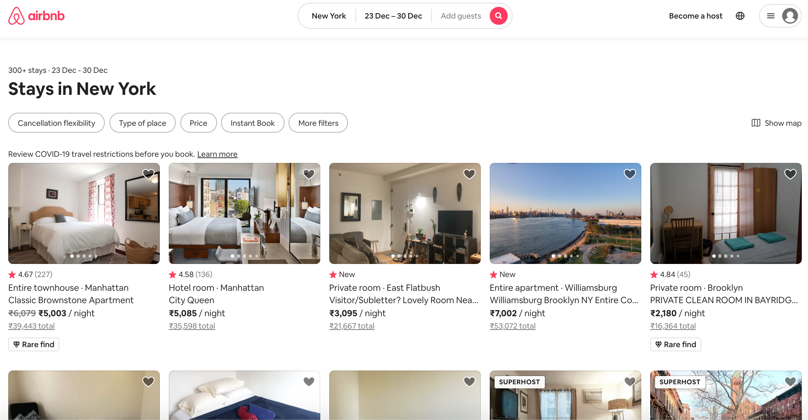
            </div>
          </div>
        </div>
        <div class="col-lg-6 col-md-6 col-12">
          <div class="row">
            <div class="col-lg-12 col-12 image_header">Variation (Version with new features)</div>
          </div>
          <div class="row">
            <div class="col-lg-12 col-12 doc_image_block">
              
            </div>
          </div>
        </div>
      </div>
    </div>
  </div>

  <div class="row">
    <div class="col-lg-8 col-md-10 col-sm-10 col-12 mx-auto">
      <h5 class="sub-title">Step 4: Run A/B (Split) Testing</h5>
    </div>
  </div>

  <div class="row">
    <div class="col-lg-8 col-md-10 col-sm-10 col-12 mx-auto">
      <p>
        After the <em>Control</em> and <em>Variation</em> versions of the webpage are setup, the next step is to run the split tests. For this purpose, the visitors to the webpage will be split and redirected to the two different versions. This means that a portion of the visitors will see the <em>Control</em> version whereas the rest will see the <em>Variation</em> version. The following test parameters will need to be defined before running the tests,
      </p>
    </div>
  </div>

  <div class="row">
    <div class="col-lg-10 col-md-10 col-sm-10 col-12 mx-auto">
      <table class="table table-sm table-striped table-bordered table-hover">
        <thead>
          <tr>
            <th scope="col">Parameter</th>
            <th scope="col">Value</th>
            <th scope="col">Description</th>
          </tr>
        </thead>
        <tbody>
          <tr>
            <th scope="row">Split Ratio</th>
            <td>0.5</td>
            <td>The ratio of the visitors who will see the <em>Control</em> and <em>Variation</em> versions.</td>
          </tr>
          <tr>
            <th scope="row">Test Duration</th>
            <td>10,000 sessions</td>
            <td>The duration to which the test needs to be run. This is a trade-off between two factors. The test needs to be run long enough to establish statistical significance and draw any meaningful conclusions. At the same time, if the new feature (variation) results in degradation of sales or engagement then it is important to make sure that test is not run for too long in order to minimise loss in revenue.</td>
          </tr>
          <tr>
            <th scope="row">Sample Distribution</th>
            <td>Normal</td>
            <td>The distribution of values for metrics need to be assumed in order to use a suitable Test statistic. For example, the values for metric <em>Booking Time</em> can be assumed to be <em>Gaussian</em>.</td>
          </tr>
          <tr>
            <th scope="row">Test Statistic</th>
            <td>Z-test</td>
            <td>A <em>Z-test</em> is any statistical test for which the distribution of the test statistic under the <em>Null hypothesis</em> can be approximated by a normal distribution. It measures how far the test statistic is from the mean of the normal distribution under <em>Null Hypothesis</em>. Higher the value, less likely it is for the test statistic to be under <em>Null Hypothesis</em>, making it possible to reject <em>Null Hypothesis</em> with greater confidence.</td>
          </tr>
          <tr>
            <th scope="row">Significance Level (p-value)</th>
            <td>0.01</td>
            <td>A <em>p-value</em> is a measure of the probability that an observed difference could have occurred just by random chance. The lower the <em>p-value</em>, the greater the statistical significance of the observed difference.</td>
          </tr>
        </tbody>
      </table>
        
    </div>
  </div>

  <div class="row">
    <div class="col-lg-8 col-md-10 col-sm-10 col-12 mx-auto">
      <p>
        The following animation illustrates how the <em>Z-test statistic</em> and <em>p-value</em> varies for different distributions of <em>Variation</em> as compared to the <em>Control</em>.
      </p>
    </div>
  </div>

  <div class="row">
    <div class="col-lg-6 col-md-10 col-sm-10 col-11 mx-auto doc_image">
      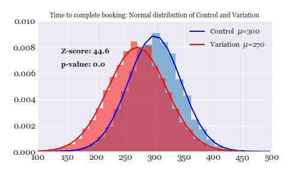
    </div>
  </div>


  <div class="row">
    <div class="col-lg-8 col-md-10 col-sm-10 col-12 mx-auto">
      <h5 class="sub-title">Step 5: Collecting Data and Statistical Analysis</h5>
    </div>
  </div>

  <div class="row">
    <div class="col-lg-8 col-md-10 col-sm-10 col-12 mx-auto">
      <p>
        For the purpose of this project, sample simulated data will be used in order to perform statistical analysis of A/B Testing. The values for the two pre-defined project metrics are as shown in the following table.
      </p>
    </div>
  </div>

  <div class="row">
    <div class="col-lg-8 col-md-10 col-sm-10 col-12 mx-auto">
      <table class="table table-sm table-striped table-bordered table-hover">
        <thead>
          <tr>
            <th scope="col">Version</th>
            <th scope="col">No. of Sessions</th>
            <th scope="col">Average Booking Time (Time)</th>
            <th scope="col">Standard Deviation (Time) </th>
            <th scope="col">Conv-ersion Rate</th>
          </tr>
        </thead>
        <tbody>
          <tr>
            <th scope="row">Control</th>
            <td>10,000</td>
            <td>300 seconds</td>
            <td>85 seconds</td>
            <td>1.50 %</td>
          </tr>
          <tr>
            <th scope="row">Variation</th>
            <td>10,000</td>
            <td>296 seconds</td>
            <td>93 seconds</td>
            <td>2.00 %</td>
          </tr>
        </tbody>
      </table>
    </div>
  </div>

  <div class="row">
    <div class="col-lg-8 col-md-10 col-sm-10 col-12 mx-auto">
      <p>
        The following code snippets show how the test statistics can be obtained for simulated data presented in the table above.
      </p>
    </div>
  </div>

```
# A/B testing: Z-test for Booking time (Normal Distribution)
from scipy.stats import norm

mu_A, std_A, n_A = 300, 105, 10000
mu_B, std_B, n_B = 296, 120, 10000

Z = (mu_A - mu_B)/np.sqrt(std_B**2/n_B + std_A**2/n_A)
pvalue = norm.sf(Z)
```

```
# A/B Testing: Conversion Rate: Distance between chi-squared distributions
from scipy.stats import chi2

T = np.array([165, 165, 9835, 9835])
O = np.array([150, 180, 9850, 9800])

D = np.sum(np.square(T-O)/T)

pvalue = chi2.sf(D, df=1)
```

  <div class="row">
    <div class="col-lg-8 col-md-10 col-sm-10 col-12 mx-auto">
      <p>
        The following figures show the distribution of test statistics, Z-test score for Booking Time Hypothesis, Distance for Conversion Rate Hypothesis and the corresponding p-values.
      </p>
    </div>
  </div>

  <div class="row img_block img_block_abtesting">
    <div class="col-lg-10 col-md-12 col-sm-12 col-12 mx-auto">
      <div class="row">
        <div class="col-lg-6 col-md-6 col-12">
          <div class="row">
            <div class="col-lg-12 col-md-12 col-12 image_header">Hypothesis 1: Time For Booking</div>
          </div>
          <div class="row">
            <div class="col-lg-12 col-md-12 col-12 doc_image_block">
              
            </div>
          </div>
        </div>
        <div class="col-lg-6 col-md-6 col-12">
          <div class="row">
            <div class="col-lg-12 col-md-12 col-12 image_header">Hypothesis 2: Conversion Rate</div>
          </div>
          <div class="row">
            <div class="col-lg-12 col-md-12 col-12 doc_image_block">
              
            </div>
          </div>
        </div>
      </div>
    </div>
  </div>

  <div class="row">
    <div class="col-lg-8 col-md-10 col-sm-10 col-12 mx-auto">
      <h5 class="sub-title">Step 6: Analyse Results and Draw Conclusions</h5>
    </div>
  </div>


  <div class="row">
    <div class="col-lg-8 col-md-10 col-sm-10 col-12 mx-auto">
      <p>
        The final step in A/B Testing is to analyse the results of statistical analysis and based on that to draw conclusions.
        <ul>
          <li>
            <b>Can the Null Hypothesis be rejected with confidence ?</b>
            <ul>
              <li>
                <b>Hypothesis 1: Booking Time - Was there significant decrease in mean booking time ?</b>
                The <em>Z-test</em> score is <em>2.51</em> which corresponds to <em>p-value</em> of <em>0.0061</em> which is lower than the pre-defined <em>Significance level = 0.01</em>. So we can conclude that <em>Null Hypothesis</em> can be rejected and that the <em>Mean Booking Time</em> reduced by 4seconds in the <em>Variation</em> as compared to the <em>Control</em> version of the webpage.
              </li>
              <li>
                <b>Hypothesis 2: Conversion Rate - Was there significant increase in Conversion Rate ?</b>
                The <em>Distance</em> metric is <em>2.87</em> which corresponds to <em>p-value</em> of <em>0.089</em> which is higher than the pre-defined <em>Significance level = 0.01</em>. So we cannot reject the <em>Null Hypothesis</em> and hence we cannot conclude that there is any significant improvement in <em>Conversion Rate</em> in the <em>Variation</em> as compared to the <em>Control</em> version of the webpage.
              </li>
            </ul>
          </li>
          <li>
            <b>What was the eventual impact on business metric (was there a significant increase in revenue) ?</b> If the test is done methodologically, the result should be evident at the end of A/B Testing. However at times, it is possible that although the new feature improved the business metric over short-term, the same might not be true over long term. Hence it is important to constantly monitor the metrics, set up continuous testing and keep learning from changing customer behaviour.
          </li>
          <li>
            <b>Learn from user behaviour, set up and continue with more A/B Testing</b>: One of the additional benefits of A/B Testing is that at times, there will be unexpected and surprising results or insights that will be observed which are not related to the Metric trying to be optimised. So even if the new feature does not add significant improvements in sales or engagement, a number of other insights can be used to set up further tests in the future.
          </li>
        </ul>
      </p>
    </div>
  </div>


<div class="row">
        <div class="col-lg-8 col-md-10 col-sm-10 col-12 mx-auto">
          <h2>Deployment, Serving and Production: CI/CD Pipeline</h2>
        </div>
      </div>

  <div class="row">
    <div class="col-lg-8 col-md-10 col-sm-10 col-12 mx-auto">
      <p>
        A <em>FLASK</em> Webapp was developed in order to demonstrate the Search by <em>Image Aesthetics</em> and <em>Listing Vibe</em> features. Using this, the users can sort the listings based on <em>Image Aesthetics</em> and also filter listings based on <em>Listing Vibe</em>. The webapp was containerised using <em>Docker</em> and was deployed on <em>AWS Cloud</em>. A CI/CD Pipeline was setup in order to facilitate continuous integration and deployment. The following block diagram shows all the components in the entire pipeline. The Deployed Webapp can be accessed <a href="http://ec2-65-0-106-104.ap-south-1.compute.amazonaws.com:5002/">here</a>.
      </p>
    </div>
  </div>

  <div class="row">
    <div class="col-lg-8 col-md-10 col-sm-10 col-11 mx-auto doc_image">
      
    </div>
  </div>

  <div class="row">
    <div class="col-lg-8 col-md-10 col-sm-10 col-12 mx-auto">
      <p>
        The production pipeline consists of the following components,
        <ul>
          <li><b>FLASK Webapp</b>: Webapp and REST API to serve Model Predictions</li>
          <li><b>Docker</b>: Containerised FLASK Webapp which can then be deployed in any environment</li>
          <li><b>AWS</b>: CI/CD Pipeline</li>
          <ul>
            <li><b>ECR Repository</b>: The Docker Image is stored in this repository. Any changes to this image will trigger changes in the rest of the pipeline and the updates to the image will then be deployed to the Web Application.</li>
            <li><b>CodeCommit </b>: The pipeline is configured to use a source location where the following two files are stored,
              <ul>
                <li><b>Amazon ECS Task Definition file</b>: The task definition file lists Docker image name, container name, Amazon ECS service name, and load balancer configuration.</li>
                <li><b>CodeDeploy AppSpec file</b>: This specifies the name of the Amazon ECS task definition file, the name of the updated application's container, and the container port where CodeDeploy reroutes production traffic.</li>
              </ul>
            <li><b>CodeDeploy</b>: Used during deployment to reference the correct deployment group, target groups, listeners and traffic rerouting behaviour. CodeDeploy uses a listener to reroute traffic to the port of the updated container specified in the AppSpec file
              <ul>
                <li><b>ECS Cluster</b>: Cluster where CodeDeploy routes traffic during deployment</li>
                <li><b>Load Balancer</b>: The load balancer uses a VPC with two public subnets in different Availability Zones.</li>
              </ul>
            </li>
          </ul>
        </ul>
      </p>
    </div>
  </div>
