# Predictive Price Modeling for Airbnb listings
The project aimed at predicting the price of an Airbnb listing given a number of features. The project involved exploratory data analysis, data pre-processing, feature selection, Model Fitting, Model Comparison and deploying the containerised Webapp on AWS using CI/CD Pipeline.

## Project Resources
<div class="row">
	<div class="col-lg-8 col-md-10 col-sm-10 col-12 mx-auto">
	  <ul>
	    <li><a href="http://ec2-65-0-106-104.ap-south-1.compute.amazonaws.com:5000/">AWS Webapp</a> for this project</li>
	    <li>View Project <a href="http://deepakkarkala.com/docs/articles/machine_learning/airbnb_price_modeling/about/index.html">Report</a></li>
	    <li><a href="https://public.opendatasoft.com/explore/dataset/airbnb-listings/information/?disjunctive.host_verifications&disjunctive.amenities&disjunctive.features&dataChart=eyJxdWVyaWVzIjpbeyJjaGFydHMiOlt7InR5cGUiOiJjb2x1bW4iLCJmdW5jIjoiQ09VTlQiLCJ5QXhpcyI6Imhvc3RfbGlzdGluZ3NfY291bnQiLCJzY2llbnRpZmljRGlzcGxheSI6dHJ1ZSwiY29sb3IiOiJyYW5nZS1jdXN0b20ifV0sInhBeGlzIjoiY2l0eSIsIm1heHBvaW50cyI6IiIsInRpbWVzY2FsZSI6IiIsInNvcnQiOiIiLCJzZXJpZXNCcmVha2Rvd24iOiJyb29tX3R5cGUiLCJjb25maWciOnsiZGF0YXNldCI6ImFpcmJuYi1saXN0aW5ncyIsIm9wdGlvbnMiOnsiZGlzanVuY3RpdmUuaG9zdF92ZXJpZmljYXRpb25zIjp0cnVlLCJkaXNqdW5jdGl2ZS5hbWVuaXRpZXMiOnRydWUsImRpc2p1bmN0aXZlLmZlYXR1cmVzIjp0cnVlfX19XSwidGltZXNjYWxlIjoiIiwiZGlzcGxheUxlZ2VuZCI6dHJ1ZSwiYWxpZ25Nb250aCI6dHJ1ZX0%3D">Airbnb Dataset</a> used in the project</li>
	    <li>Run this code on <a href="https://colab.research.google.com/drive/1IBYyAjdGXzAeNPSdNbfIyzgu-lG6Hvlp?usp=sharing">Google Colab</a></li>
	    <li>View Source on <a href="https://github.com/deepak-karkala/airbnb-data-science/tree/master/webapp_predict_price">Github</a></li>
	    <li>Docker Container for the project: dkarkala01/airbnb-predict</li>
	  </ul>
	</div>
</div>

## Project Goals and Objectives
<div class="row">
    <div class="col-lg-8 col-md-10 col-sm-10 col-12 mx-auto">
      <p style="margin-top:0px;">The Short Answer: Assisting Airbnb hosts to set appropriate price for their listings</p>
      <p class="p_no_top_gap">
        <b>The Problem</b>: Currently there is no convenient way for a new Airbnb host to decide the price of his or her listing. New hosts must often rely on the price of neighbouring listings when deciding on the price of their own listing.
      </p>
      <p class="p_no_top_gap">
        <b>The Solution</b>: A Predictive Price Modelling tool whereby a new host can enter all the relevant details such as location of the listing, listing properties, available amenities etc and the Machine Learning Model will suggest the Price for the listing. The Model would have previously been trained on similar data from already existing Airbnb listings.
      </p>
    </div>
 </div>

  <div class="row">
    <div class="col-lg-8 col-md-10 col-sm-10 col-12 mx-auto">
      <h3 class="sub-title">Project Overview</h3>
    </div>
  </div>

  <div class="row">
    <div class="col-lg-8 col-md-10 col-sm-10 col-12 mx-auto">
      <p class="p_no_top_gap">
        The project involved the following steps,
        <ul>
          <li><b>Exploratory Data Analysis</b>: Explore the various features, their distributions using Histograms and Box-plots</li>
          <li><b>Pre-processing and Data Cleaning</b>: Normalisation, filling missing values, encoding categorical values</li>
          <li><b>Feature Selection</b>: Study the correlation with response variable (Listing Price) and determine which features are most useful in predicting the price.</li>
          <li><b>Model Fitting and Selection</b>: Training different models, tuning hyper-parameters and studying Model performance using Learning Curve.</li>
          <li><b>Model Serving</b>: Using FLASK to deploy and serve Model predictions using REST API</li>
          <li><b>Container</b>: Using Docker to containerise the Web Application</li>
          <li><b>Production</b>: Using AWS CI/CD Pipeline for continuous integration and deployment.</li>
        </ul>
      </p>
    </div>
  </div>


  <div class="row">
    <div class="col-lg-6 col-md-10 col-sm-10 col-10 mx-auto image_top">
      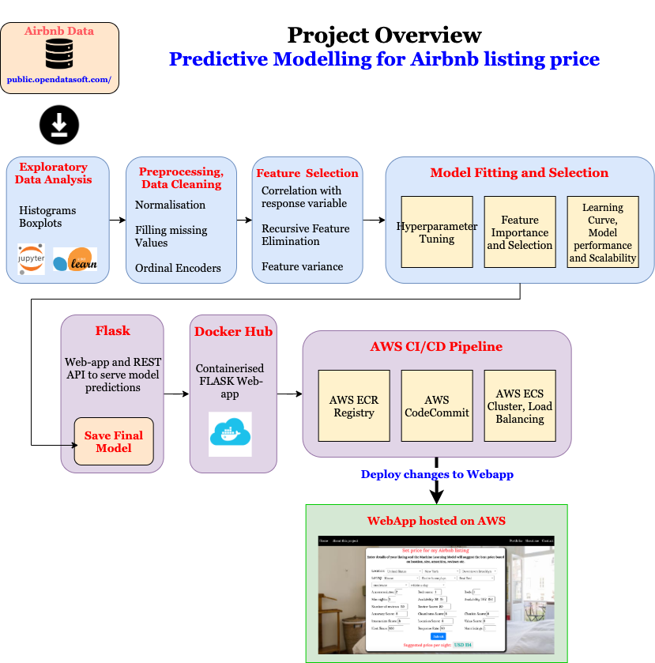
    </div>
  </div>

  <div class="row">
    <div class="col-lg-8 col-md-10 col-sm-10 col-12 mx-auto">
      <h3 class="sub-title">End Result</h3>
    </div>
  </div>

  <div class="row">
    <div class="col-lg-8 col-md-10 col-sm-10 col-12 mx-auto">
      <p class="p_no_top_gap">
        The screen capture of the entire application in use is shown below. Users can enter all the relevant details of their listings, the trained Predictive Model will then predict and return the price of the listing given all the features. The Webapp can be explored <a href="http://ec2-65-0-106-104.ap-south-1.compute.amazonaws.com:5000/">here</a>.
      </p>
    </div>
  </div>

  <div class="row">
    <div class="col-lg-6 col-md-10 col-sm-10 col-10 mx-auto image_top">
      
    </div>
  </div>

  <div class="row">
        <div class="col-lg-8 col-md-10 col-sm-10 col-12 mx-auto">
          <h2>About Dataset</h2>
        </div>
      </div>

  <div class="row">
    <div class="col-lg-8 col-md-10 col-sm-10 col-12 mx-auto">
      <p class="p_no_top_gap">
        The Dataset used in this project was obtained from <a href="https://public.opendatasoft.com/explore/dataset/airbnb-listings/table/?disjunctive.host_verifications&disjunctive.amenities&disjunctive.features&dataChart=eyJxdWVyaWVzIjpbeyJjaGFydHMiOlt7InR5cGUiOiJjb2x1bW4iLCJmdW5jIjoiQ09VTlQiLCJ5QXhpcyI6Imhvc3RfbGlzdGluZ3NfY291bnQiLCJzY2llbnRpZmljRGlzcGxheSI6dHJ1ZSwiY29sb3IiOiJyYW5nZS1jdXN0b20ifV0sInhBeGlzIjoiY2l0eSIsIm1heHBvaW50cyI6IiIsInRpbWVzY2FsZSI6IiIsInNvcnQiOiIiLCJzZXJpZXNCcmVha2Rvd24iOiJyb29tX3R5cGUiLCJjb25maWciOnsiZGF0YXNldCI6ImFpcmJuYi1saXN0aW5ncyIsIm9wdGlvbnMiOnsiZGlzanVuY3RpdmUuaG9zdF92ZXJpZmljYXRpb25zIjp0cnVlLCJkaXNqdW5jdGl2ZS5hbWVuaXRpZXMiOnRydWUsImRpc2p1bmN0aXZlLmZlYXR1cmVzIjp0cnVlfX19XSwidGltZXNjYWxlIjoiIiwiZGlzcGxheUxlZ2VuZCI6dHJ1ZSwiYWxpZ25Nb250aCI6dHJ1ZX0%3D">public.opendatasoft.com</a>. There are a total of 494,954 records each of which contains details of one Airbnb listing. The total size of dataset is 1.89 GB. 
      </p>
      <p class="p_no_top_gap">
        The dataset has a large number of features which can be categorised into following types,
        <ul>
          <li>
            <b>Location related</b>: Country, City, Neighbourhood
          </li>
          <li>
            <b>Property related</b>: Property Type, Room Type, Accommodates, Bedrooms, Beds, Bed Type, Cancellation Policy, Minimum Nights
          </li>
          <li>
            <b>Booking Availability</b>: Availability 30, Availability 60, Availability 90, Availability 365
          </li>
          <li>
            <b>Reviews related</b>: Number of Reviews, Reviews per Month, Review Scores Rating, Review Scores Accuracy, Review Scores Cleanliness, Review Scores Checkin, Review Scores Communication, Review Scores Location, Review Scores Value
          </li>
          <li>
            <b>Host related</b>: Host Since, Host Response Time, Host Response Rate, Calculated host listings count, Host Since Days, Host Has Profile Pic, Host Identity Verified, Is Location Exact, Instant Bookable, Host Is Superhost, Require Guest Phone Verification, Require Guest Profile Picture, Requires License
          </li>
          <li>
            <b>Amenities</b>: TV, Wireless Internet, Kitchen, Heating,
             Family/kid friendly, Washer, Smoke detector, Fire extinguisher,
             Essentials, Cable TV, Internet, Dryer, First aid kit,
             Safety card, Shampoo, Hangers, Laptop friendly workspace,
             Air conditioning, Breakfast, Free parking on premises,
             Elevator in building, Buzzer/wireless intercom, Hair dryer,
             Private living room, Iron, Wheelchair accessible, Hot tub,
             Carbon monoxide detector, 24-hour check-in,
             Pets live on this property, Dog(s), Gym, Lock on bedroom door,
             Private entrance, Indoor fireplace, Smoking allowed,
             Pets allowed, Cat(s), Self Check-In, Doorman Entry,
             Suitable for events, Pool, Lockbox, Bathtub,
             Room-darkening shades, Game console, Doorman, High chair,
             Pack ’n Play/travel crib, Keypad, Other pet(s), Smartlock
          </li>
        </ul>
      </p>
      <p class="p_no_top_gap">
        The price of the listing will serve as labels for the regression task. The goal of this project would be to predict these price of the listings.
      </p>
    </div>
  </div>


<div class="row">
        <div class="col-lg-8 col-md-10 col-sm-10 col-12 mx-auto">
          <h2>Exploratory Analysis</h2>
        </div>
      </div>

  <div class="row">
    <div class="col-lg-8 col-md-10 col-sm-10 col-12 mx-auto">
      <p class="p_no_top_gap">
        To get a better insight into where the listings are located, the number of listings in various cities and countries are plotted in the figure below. In the given dataset, United States has the most number of listings followed by European countries and Australia. In terms of cities, Paris, London, New York, Berlin, Los Angeles are some of the cities with most number of listings. 
      </p>
      <p>
        Airbnb offers three types of listings,
        <ul>
          <li><b>Entire home/apartment</b></li>
          <li><b>Private Room</b></li>
          <li><b>Shared Room</b></li>
        </ul>
        Entire home is by far the most popular type of listing offered followed by Private Rooms and then a small share of the total listings are shared rooms.
      </p>
    </div>
  </div>

  <div class="row">
    <div class="col-lg-8 col-md-12 col-sm-12 col-12 mx-auto">
      <div class="row img_block">
        <div class="col-lg-6 col-md-6 col-sm-12 col-12 mx-auto img_container">
          
        </div>
        <div class="col-lg-6 col-md-6 col-sm-12 col-12 mx-auto">
          <div class="row">
            <div class="col-lg-12 col-12 img_container">
              
            </div>
          </div>
          <div class="row">
            <div class="col-lg-12 col-12 img_container">
              
            </div>
          </div>
        </div>
      </div>
    </div>
  </div>

  <div class="row">
    <div class="col-lg-8 col-md-10 col-sm-10 col-12 mx-auto">
      <p class="p_no_top_gap">
        Intuitively it is reasonable to expect that the listing location and the listing property type are two of the most important factors in determining the price of the listing. The following plots shows the distribution of listing prices across various cities and the difference in price amongst the three property types.
      </p>
    </div>
  </div>

  <div class="row">
    <div class="col-lg-8 col-md-12 col-sm-12 col-12 mx-auto">
      <div class="row img_block">
        <div class="col-lg-6 col-md-6 col-sm-12 col-12 mx-auto img_container">
          
        </div>
        <div class="col-lg-6 col-md-6 col-sm-12 col-12 mx-auto">
          <div class="row">
            <div class="col-lg-12 col-12 img_container">
              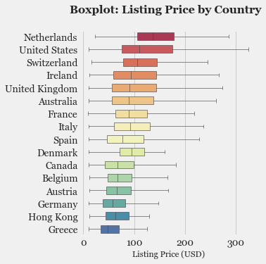
            </div>
          </div>
          <div class="row">
            <div class="col-lg-12 col-12 img_container">
              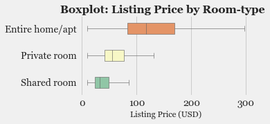
            </div>
          </div>
        </div>
      </div>
    </div>
  </div>

  <div class="row">
    <div class="col-lg-8 col-md-10 col-sm-10 col-12 mx-auto">
      <p class="p_no_top_gap">
        Few noticeable observations from the above plots,
        <ul>
          <li>Netherlands, US, Switzerland, Ireland, UK have amongst the highest average listing price.</li>
          <li>In terms of cities, 10 of the top 12 cities with the highest average listing price are in the US. Clearly Airbnb listings are more expensive in the US compared to other European cities.</li>
          <li>As expected, the cities with the highest listing prices are all major tourist attractions. Outside of the US, Amsterdam and Venice are the cities with highest average listing price.</li>
          <li>As expected, <em>Entire homes</em> have the highest prices followed by <em>Private Room</em> and then <em>Shared Rooms</em>.</li>
        </ul>
      </p>
    </div>
  </div>

<div class="row">
        <div class="col-lg-8 col-md-10 col-sm-10 col-12 mx-auto">
          <h2>Feature Engineering: What features will be useful in predicting the listing price ?</h2>
        </div>
      </div>

  <div class="row">
    <div class="col-lg-8 col-md-10 col-sm-10 col-12 mx-auto">
      <p>
        Although the dataset consists of large number of features for listings, not all of them will help in predicting the listing price. In fact, different features will have different influences in .Feature Engineering refers to selecting a subset of features or adding new features which will aid in better prediction of the response variable which is the <em>Listing Price</em> in this project. 
      </p>
      <p>
        The following figures show the distribution of various features against the listing price. This will aid in determining which features are correlated with the listing price and can thereby result in the Models making better predictions.
      </p>
    </div>
  </div>

  <div class="row">
    <div class="col-lg-10 col-md-10 col-sm-10 col-11 mx-auto">
      <div class="row img_block">
        <div class="col-lg-4 col-md-4 col-sm-4 col-6 mx-auto">
          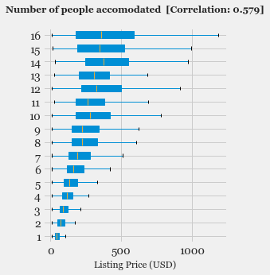
        </div>
        <div class="col-lg-4 col-md-4 col-sm-4 col-6 mx-auto">
          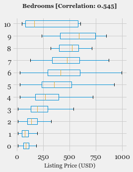
        </div>
        <div class="col-lg-4 col-md-4 col-sm-4 col-6 mx-auto">
          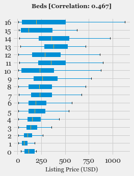
        </div>
        <div class="col-lg-4 col-md-4 col-sm-4 col-6 mx-auto">
          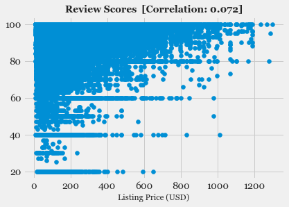
        </div>
        <div class="col-lg-4 col-md-4 col-sm-4 col-6 mx-auto">
          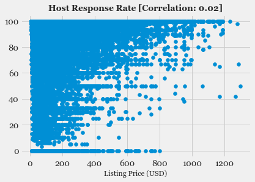
        </div>
        <div class="col-lg-4 col-md-4 col-sm-4 col-6 mx-auto">
          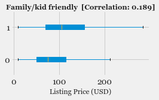
        </div>
        <div class="col-lg-4 col-md-4 col-sm-4 col-6 mx-auto">
          
        </div>
        <div class="col-lg-4 col-md-4 col-sm-4 col-6 mx-auto">
          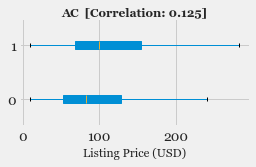
        </div>
        <div class="col-lg-4 col-md-4 col-sm-4 col-6 mx-auto">
          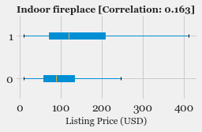
        </div>
        <div class="col-lg-4 col-md-4 col-sm-4 col-6 mx-auto">
          
        </div>
        <div class="col-lg-4 col-md-4 col-sm-4 col-6 mx-auto">
          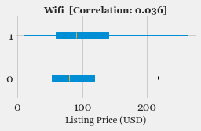
        </div>
        <div class="col-lg-4 col-md-4 col-sm-4 col-6 mx-auto">
          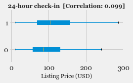
        </div>
      </div>
    </div>
  </div>

  <div class="row">
    <div class="col-lg-8 col-md-10 col-sm-10 col-12 mx-auto">
      <p class="p_no_top_gap">
        As expected, the most important factors that determine the price of a listing are <em>Number of people accommodated</em>, <em>Number of bedrooms</em>, <em>Number of beds</em>, all of which have a Pearson's Correlation Factor of more about 0.45 with the <em>Listing Price</em>. Amenities like TV, AC also show a slight positive correlation. But it is clear that there are no hidden features which plays a major role in determining the listing price, bigger the home/apartment with more bedrooms and beds, higher is the listing price.
      </p>
    </div>
  </div>

  <div class="row">
        <div class="col-lg-8 col-md-10 col-sm-10 col-12 mx-auto">
          <h2>Data pre-processing and cleaning</h2>
        </div>
      </div>

  <div class="row">
    <div class="col-lg-8 col-md-10 col-sm-10 col-12 mx-auto">
      <p class="p_no_top_gap">
        Before feeding these features as input to the Machine Learning Model, the data will need to be pre-processed and cleaned. The following block diagram shows the Data Pipeline with the operations involved in pre-processing and data splitting.
      </p>
    </div>
  </div>

  <div class="row">
    <div class="col-lg-5 col-md-8 col-sm-10 col-11 mx-auto image_top">
      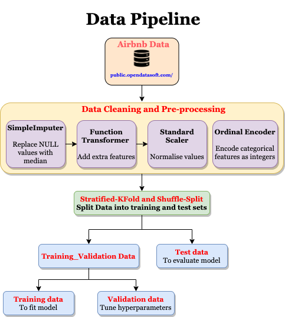
    </div>
  </div>

  <div class="row">
    <div class="col-lg-8 col-md-10 col-sm-10 col-12 mx-auto">
      <h3 class="sub-title">Data Pre-processing</h3>
    </div>
  </div>

  <div class="row">
    <div class="col-lg-8 col-md-10 col-sm-10 col-12 mx-auto">
      <p class="p_no_top_gap">
        The pre-processing operations involved are listed in the following table.
      </p>
      <table class="table table-sm table-bordered table-hover">
        <thead>
          <tr>
            <th scope="col">Name</th>
            <th scope="col">Feature Type</th>
            <th scope="col">Operation</th>
          </tr>
        </thead>
        <tbody>
          <tr>
            <th scope="row">Imputer</th>
            <td>Numerical</td>
            <td>Replace NULL values with Median</td>
          </tr>
          <tr>
            <th scope="row">Standard Scaler </th>
            <td>Numerical</td>
            <td>Standardise input data to have 0 mean and unit variance</td>
          </tr>
          <tr>
            <th scope="row">Ordinal Encoder</th>
            <td>Categorical</td>
            <td>Encode discrete values into integers</td>
          </tr>
        </tbody>
      </table>
      <p>
        The following code snippet shows the pre-processing pipeline implemented using the Python library <em>Scikit learn</em>.
      </p>
    </div>
  </div>

```
# Preprocessing pipeline for Numerical and Categorical features

from sklearn.pipeline import Pipeline
from sklearn.preprocessing import StandardScaler
from sklearn.preprocessing import OrdinalEncoder
from sklearn.compose import ColumnTransformer


############ Pipeline for numerical features #############
# Numerical features
numerical_attribs = [   'Accommodates', 'Bedrooms', 'Beds', 'Minimum Nights',
             'Availability 30', 'Availability 60', 'Availability 90',
             'Availability 365', 'Number of Reviews', 'Reviews per Month',
             'Review Scores Rating', 'Review Scores Accuracy', 'Review Scores Cleanliness',
             'Review Scores Checkin', 'Review Scores Communication', 'Review Scores Location',
             'Review Scores Value', 'Host Response Rate']

# Pipeline for numerical features
# 1. SimpleImputer: Replace NULL values with median
# 2. FunctionTransformer: Add extra features
# 3. StandardScaler: Normalise values
numerical_pipeline = Pipeline([
        ('imputer', SimpleImputer(strategy="median")), 
        ('attribs_adder', FunctionTransformer(add_extra_features, validate=False)),
        ('std_scaler', StandardScaler()),
    ])


########## Pipeline for categorical features #############
# Categorical features
categorical_attribs = ["Country", "City", "Neighbourhood Cleansed",
                    "Property Type", "Room Type", "Bed Type", "Cancellation Policy",
                    "Host Response Time"]

# OrdinalEncoder(): Encode categorical features as integers
categorical_pipeline = Pipeline([
                            ('ordinal_encoder', OrdinalEncoder()),
                            ])


########## Combined Pipeline for all features ############
preprocessing_pipeline = ColumnTransformer([
        ("categorical", categorical_pipeline, categorical_attribs),
        ("numerical", numerical_pipeline, numerical_attribs),
    ])

# Labels
label = ["Price"]

# Combine numerical and categorical features
df_attribs = df[categorical_attribs + numerical_attribs + label].copy()
# Fit Preprocessing pipeline
df_prepared = preprocessing_pipeline.fit_transform(df[categorical_attribs + numerical_attribs])

# Save preprocessing pipeline
save_model(model=preprocessing_pipeline, save_path="preprocessing_pipeline.pkl")
```

  <div class="row">
    <div class="col-lg-8 col-md-10 col-sm-10 col-12 mx-auto">
      <p>
        After pre-processing, the dataset is divided into 3 splits the details of which are listed in the following table.
      </p>
    </div>
  </div>

  <div class="row">
    <div class="col-lg-8 col-md-10 col-sm-10 col-12 mx-auto">
      <table class="table table-sm  table-bordered table-hover">
        <thead>
          <tr>
            <th scope="col">Data</th>
            <th scope="col">Purpose</th>
            <th scope="col">Split Ratio</th>
            <th scope="col">Number of Samples</th>
          </tr>
        </thead>
        <tbody>
          <tr>
            <th scope="row">Training</th>
            <td>To fit Model</td>
            <td>0.8</td>
            <td>270,058</td>
          </tr>
          <tr>
            <th scope="row">Validation</th>
            <td>To tune hyperparameters</td>
            <td>0.1</td>
            <td>33,757</td>
          </tr>
          <tr>
            <th scope="row">Test</th>
            <td>To evaluate model performance</td>
            <td>0.1</td>
            <td>33,757</td>
          </tr>
        </tbody>
      </table>
    </div>
  </div>